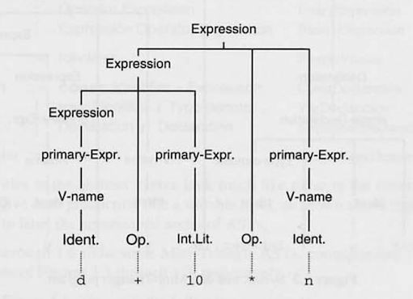

# Introduction

## 1.1 Levels of programming language
머신(machine)는 기계어로 표현된 프로그램으로 구동된다. 기계어 프로그램은 명령어의 시퀀스로 이루어져 있으며, 각 명령어는 특정 동작을 수행하도록 머신에 의해 해석된다. 

일반적으로 기계어는 아래와 같은 아주 기본적인 동작을 할 수 있다.
* 336 주소 메모리에서 데이터를 Load
* 레지스터 1, 2가 갖고 있는 수를 Add
* 이전 Operation 결과가 0이면, 13번째 명령줄로 Jump

컴퓨팅 초기에는 프로그램들을 기계어로 직접 작성했다. 위의 동작을 기계어로 표현하면 아래와 같다.

* 0000 0001 0110 1110
* 0100 0001 0001 0010
* 1100 0000 0000 1101

이렇게 이진수로 작성된 프로그램은 간단하게 머신에 로드되어 동작 될 수 있다.

이러한 기계어는 프로그래머가 읽거나 수정하기 힘들다. 그렇기에 프로그래머들은 보다 쉽게 코드를 작성하기 위해 *심볼릭 표기법(symbolic notation)*을 만들어냈다. 이 표기법에선 위의 명령어들이 아래와 같이 표현 될 수 있다.

* LOAD x
* ADD R1 R2
* JUMPZ h

과거의 프로그래머들은 이러한 심볼들을 종이에 적고, 수동으로 기계어로 변환을 했으며, 이 과정을 *어셈블링(assembling)*이라고 불렀다.

그 후 프로그래머들은 수동으로 어셈블링하던 과정을 개선하기 위해, 어셈블링을 하는 프로그램을 만들게 되었다. 이 작업을 하기위해선 심볼릭 표기법을 표준화할 필요성이 생겼다. 그렇게 표준화된 것을 현재 *어셈블리 언어(assembly language)*라 부른다.

이런 어셈블리 언어를 사용하던 프로그래머들도 기계어에서 자유롭게 된 것은 아니였다. 여전히 기계어를 염두하며 프로그램을 만들어야 했다. 커서를 어디로 옮길지, 어떤 레지스터에 값을 저장할지 등에 세부적으로 관심을 갖게 되는 경향이 생겼다.

```
sqrt(s x (s - a) x (s - b) x (s - c)) 
where s = (a + b + c) / 2
```

위의 식을 어셈블리 언어로 표현하면 아래와 같다.

```
LOAD R1 a; ADD R1 b; ADD R1 c; DIV R1 #2;
LOAD R2 R1;
LOAD R3 R1; SUB R3 a; MULT R2 R3;
LOAD R3 R1; SUB R3 b; MULT R2 R3;
LOAD R3 R1; SUB R3 c; MULT R2 R3;
LOAD RO R2; CALL sqrt
```

어셈블리 언어를 사용하더라도 산술동작에 집중하게 되기보단, 저수준 명령어에 집중하게 되는 상황이 발생한다.

만약 아래처럼 우리에게 친숙한 수학 표기법을 사용했다면, 프로그래밍 훨씬 쉬워질 것 이다.

```
let s = (a + b + c) / 2
in sqrt(s * (s - a) * (s - b) * (s - c)
```

오늘날 대부분의 프로그래밍 언어는 위와 같다. 이러한 언어를 *고수준 언어(high-level language)*라고 하며, 이와 대조 되는 기계어, 어셈블리 언어를 *저수준 언어(low-level language)*라 한다.

저수준 언어는 기계에 좀 더 가까운 표현이기에 그리고 고수준 언어는 우리의 머리속 개념들과 더 가깝게 표현할 수 있기에 그렇게 불린다.

다음은 고수준 언어에는 지원되지만, 저수준 언어엔 없을 수 있는 개념들이다.

* Expressions: 표현은 값을 계산하는 규칙이다. 고수준 언어에서는 수학적 표기법과 비슷하게 작성할 수 있다. (ex. '+', '-', '*') 
* Data types: boolean, char, int 등의 primitive 타입과 array, record 등의 composite 타입을 지원한다. 그리고 프로그래머가 직접 타입 정의할 수도 있다.
* Declarations: 정의는 프로그래머에게 식별자를 도입하여 함수, 상수, 변수 타입과 같은 엔티티들을 나타낼 수 있게 한다.
* Encapsulation: 패키지, 클래스를 통해 프로그래머가 정의한 것들을 선택적으로 노출할 수 있게 한다.

## 1.2 Programming language processors
*프로그래밍 언어 처리기(programming language processor)*은 특정 언어로 작성된 프로그램을 만들어내는 시스템을 말한다.

위의 언어 처리기의 정의는 일반적인 것이며, 좀더 구체적으로는 아래와 같은 시스템들을 말한다.

* Editors: 에디터는 프로그램을 작성, 수정, 저장 할 수 있게하는 것을 말한다. 일반 텍스트 에디터도 포함되며, 프로그래밍을 작성하기 쉽게 맞춤화 된 에디터도 있다.
* Translators, Compilers: 변환기는 어떤 언어로 작성된 것을 다른 언어로 변환하는 시스템을 말한다. 이중에 고수준 언어를  저수준 언어로 변환하는 것을 컴파일러라 한다.
* Interpreters: 인터프리터는 특정 언어로 작성된 프로그램을 즉시 실행시킨다. 이러한 실행방식은 컴파일 과정을 생략하고 바로 응답한다.

이미 우리는 위와 같은 언어 처리기를 사용하고 있다. 예전에는 이러한 시스템들이 모두 분리되어 있었는데, 요즘에는 통합하여 제공하는 추세이다.

예1) 언어 처리기를 각각 사용하는 경우  
1. 개발자가 에디터를 실행하여, Chess.java 파일을 작성한다. 'vi Chess.java'
2. 자바 컴파일러를 실행한다. 'javac Chess.java'
3. 자바 프로그램을 실행한다. 'java Chess'

만약 컴파일을 실패하거나, 프로그램이 잘못 동작하면 개발자는 위의 동작을 반복한다. 이 방식엔 각 언어 처리기(에디터, 컴파일러)간 커뮤니케이션이 없다. 컴파일러가 에러를 내면 개발자가 직접 에디터에 가서 그 에러를 찾고 수정해야 한다.

예2) 통한 언어 처리기 사용  
개발자는 통합 환경에서 프로그램을 작성/수정한다. 그리고 컴파일 및 프로그램 동작까지 할 수 있다.

만약 컴파일 실패 혹은 프로그램 오동작이 발생하면 통합 환경에서 에러 리포트를 받아 볼 수 있고 바로 수정할 수 있다.

오늘날은 아래의 예시와 같은 통합 환경을 많이 사용한다.

## 1.3 Specification of programming languages
프로그래밍 언어에 직접적으로 연관이 되는 여러 그룹이 존재한다. 이 모든 사람들은 언어에 대한 공통된 이해가 필요하며, 이를 위해 표준적인 언어 사양을 참조해야 한다. 이때 아래와 같은 명세는 필수적이다.

* Syntax: *구문법(Syntax)*은 프로그램의 형태와 관련된다. 언어에서 구문법은 프로그램에서 어떤 토큰이 사용되는지, 어떤 구문이 토큰과 하위구문의 조합으로 구성되는지에 대한 방법을 정의하는 것이다.
* Context constraints: *문맥 제약(Context constraints)*은 아래와 같은 규칙들을 말한다.
    * Scope rules: *범위 규칙(Scope rules)*은 각 선언의 범위를 결정하고 그 범위내에서 각 식별자의 선언을 찾을 수 있도록 하는 규칙이다.
    * Type rules: *타입 규칙(Type rules)*은 각 표현식의 타입을 유추하고 각 연산에 올바른 피연산자가 제공되는지 확인 할 수 있도록 하는 규칙이다.
* Semantics: *의미론(Semantics)*은 프로그램의 의미와 관련 있다. 의미론의 지정하는 방식에는 여러가지가 있는데, 그 중 하나는 입출력을 수학 함수로 지정하는 표시적 의미론이며, 또 하나는 프로그램이 기계에서 실행될 때의 동작으로 의미를 지정하는 *동작 의미론*이다. 이 책의 경우 언어 처리기에 대한 내용이기 때문에 후자의 의미론 관점을 선호한다.

프로그래밍 언어 명세를 지정할때 아래와 같은 두가지 방식으 존재한다.

* informal specification: 영어 혹은 다른 자연어로 쓰여진 명세를 말한다. 명세가 잘 작성되면, 모든 사용자가 쉽게 이해할 수 있지만 실제론 힘들며, 잘못 해석될 여지가 많다.
* formal specification: 정확한 표기법으로 작성된 명세를 말한다. 이 경우 모호함이 없고 일관성과 완결성이 있기 때문에 잘못 해석 될 여지가 적다. 하지만 표기법을 알고 있는 사람만 이해 할 수 있다는 단점이 있다.

실제론 위의 2개를 섰어서 사용한다. Sytax는 BNF 혹은 그 변현을 이용한 formal specification을 사용한다. contextual constraints과 semantics은 informal 명세를 사용한다. 이 명세들은 formal으로 표현하기 어렵고, 가능한 표기법이 아직 널리 사용되고 있지 않기 때문이다.

### 1.3.1 Syntax
구문법은 프로그램의 형태와 관련이 있으며, 문맥과 상관 없는 문법을 통해, 프로그래밍 언어의 구문을 형식적으로 지정 할 수 있다. 이는 다음과 같은 요소들로 구성된다.

* terminal symbols: 실제 프로그래밍 언어를 구성하는 원자적 심볼들을 말한다. 'while', '>=', ';' 과 같은 키워드들을 말한다.
* nonterminal symbols: 언어에서 특정 구문 종류를 말한다. 'Program', 'Command', 'Expressions', 'Declaration' 등을 말한다.
* start symbol: 이는 논터미널 심볼 중 하나이며, 이는 프로그램의 시작이 될 수 있음을 나타낸다.
* production rules: 구문이 어떠한 터미널 심볼들과 하위 구문으로 구성되는지 정의한 것을 말한다.

문법은 보통 BNF로 표현되는데, 아래와 같다.

> N ::= a  
> N ::= b

여기서 N은 논터미널 심볼이며 a, b는 터미널 심볼의 연속 혹은 또 다른 논터미널 심볼이다.

그리고 '::=' 기호는 왼쪽이 오른쪽으로 구성 되는 것을 의미하며, '|'은 대안을 나타낸다.

> N ::= a | b => N은 a 혹은 b로 구성될 수 있다.

*프로덕션 룰(Production Rule)*은 언어의 구문이 터미널 심볼과 하위 구문의 조합을 통해 어떤 형태로 구성되는지 방법들을 나열한 것을 말한다.

> ex  
> Program ::= single-Command  
> single-command ::= V-name := Exression | Identifier ( Expression )  
> ...

위의 프로덕션 룰을 통해 언어를 분석 할 수 있다. 그러고 나면 구문이 어떤 하위 구문으로 이루어지는지 확인 할 수 있고 구문의 구조도 확인 할 수 있다.

"d + 10 * n"을 프로덕션 룰을 통해 구문 구조를 그린 예시
  

위의 방식은 구문 구조에만 신경을 쓰는 방식이며, 그 구조가 어떤 의미를 갖는지에는 신경 쓰지 않는다. 

아래와 같이 같은 구조를 갖더라도 각각의 의미는 다를 수 있다.
> 
