# Language Processors

## 2.1 Translators and compilers
*변환기(Translators)* 는 어떠한 언어로 표현된 텍스트를 동일한 의미를 갖고 다른 언어로 표현된 다른 텍스트를 생성하는 프로그램이다.  

여기서 원래의 언어를 *소스언어(source language)*, 생성된 텍스트의 언어를 *타겟언어(target language)* 라 한다.  

예시
* 중국어 -> 영어 Translator
* Java -> C Translator (Java = 소스언어, C = 타겟언어)
* Java -> x86 Compiler (Java = 소스언어, x86 기계어 = 타겟언어)
* x86 assembler: (x86 assembly language = 소스언어, x86 기계어 = 타겟언어)

여기에 추가로 소스언어와 타겟언어의 타입에 따라 아래와 같은 이름으로 불리기도 한다.  
*어셈블러(Assembler)*: *어셈블리 언어(assembly language)* 를 상응되는 기계어로 변환하는 변환기를 말한다.
*컴파일러(Complier)*: 고수준 언어에서 저수준 언어로 바꾸는 Translator를 말한다.  

어셈블러, 컴파일러 대표적인 변환기의 예시이지만, 이 것들이 변환기의 전부는 아니다.  

*Translator*: 고수준 언어에서 고수준 언어로 변환하는 것  
*Deassembler*: 기계어에서 어셈블리 언어로 변환하는 것  
*Decompiler*: 저수준 언어를 고수준 언어로 변환하는 것  

이러한 변환기는 원천언어, 대상언어, 구현언어 이렇게 여러가지 언어와 연관되는데, 이러한 이유로 변환기 간의 관계를 표현할때, 헷갈리기 쉽다.  
이 책에선 이를 해결하고 관계를 직관적으로 표현하기 위해 *톰스턴 다이어그램(Tombstone diagram)* 을 사용한다.

* * *

프로그램을 표현하는 톰스턴 다이어그램  

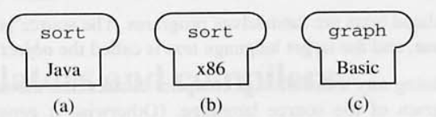  

(a) Java로 작성된 'sort' 프로그램  
(b) x86으로 작성된 'sort' 프로그램   
(c) Basic으로 작성된 'sort' 프로그램   

* * *

머신을 표현하는 톰스턴 다이어그램  

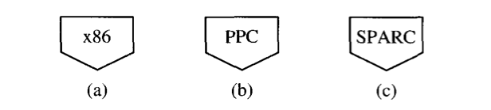  

(a) x86 머신  
(b) Power PC 머신  
(c) SPARC 머신  

* * *

머신과 프로그램의 관계를 표현한 톰스턴 다이어그램  

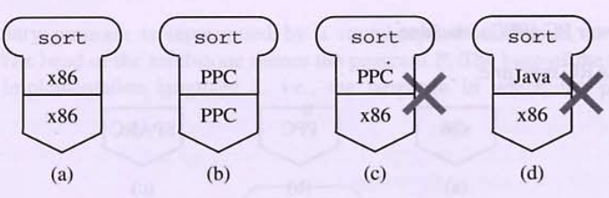

(a) x86 기계어로 표현된 sort 프로그램을 x86 기계에서 동작 시도 -> 가능   
(b) PPC 기계어로 표현된 sort 프로그램을 PPC 기계에서 동작 시도 -> 가능  
(c) PPC 기계어로 표현된 sort 프로그램을 x86 기계에서 동작 시도 -> 불가능  
(c) Java로 표현된 sort 프로그램을 x86 기계에서 동작 시도 -> 불가능  

* * *

Translator 나타내는 톰스턴 다이어그램 

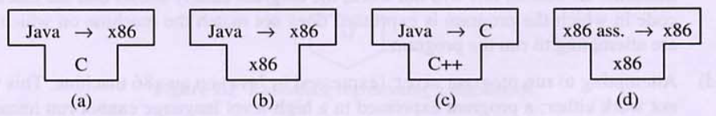  

(a) C로 표현된 Java -> x86 컴파일러  
(b) x86으로 표현된 Java -> x86 컴파일러  
(c) C++ 표현된 Java -> C Translator  
(d) x86으로 표현된 x86 assembly -> x86 assembler    

* * *

Translator를 그 자체도 프로그램이기 이다. 때문에 구현 언어에 상응되는 머신에서 동작 시켜야 한다.  
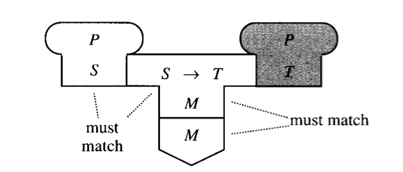  

Java -> x86 컴파일러로 컴파일하고 컴파일 된 프로그램을 실행하는 다이어그램  
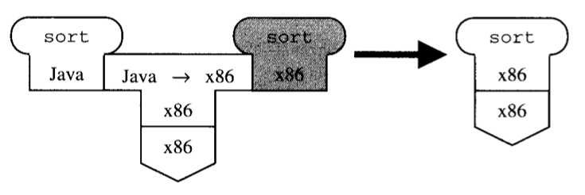  

* * *

컴파일러를 구동하는 환경과 타겟 코드가 구동되는 환경이 다른 경우도 있다.  

Cross-compiler: 동작 언어(구현언어)와 대상 언어가 구현언어가 달라서 컴파일 이후 다른 머신에 다운로드하여 동작시켜야 하는 케이스  
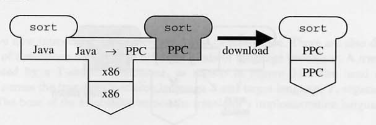  

* * *

컴파일러 2개를 이용해 2단계에 거처 컴파일 하는 경우도 있다.  
Two-stage compilation: 2단계 거처 컴파일 하는 경우  
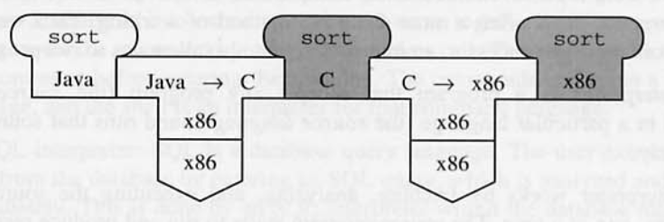

* * *

컴파일러도 프로그램이다. 작성된 언어가 고수준 언어라면, 해당 언어를 컴파일 할 수 있는 별도의 컴파일러도 필요하다.  
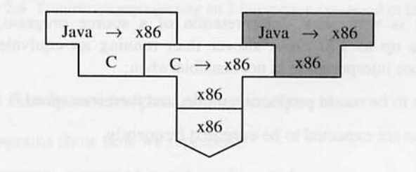  

* * *

## 2.2 Interpeters
컴파일러는 프로그램을 기계에서 동작 될 수 있게 준비한다. 그리고 머신의 최고의 속도로 프로그램을 동작시킬 수 있다. 

컴파일러의 방법이 항상 옳아보이지만, 상황에 따라 한줄씩 분석하여 동작시키는 interpreation 방식도 유용한 상황이 있다.  

대화형 모드의 프로그램, 성능이 중요하지 않고, 한번 사용하고 버려질 프로그램  

예시) UNIX command language interpreter(shell), SQL

* * *

인터프리터를 나타내는 톰스턴 다이어그램  

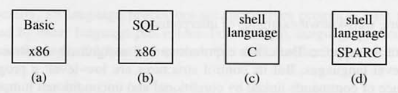  

(a) x86으로 작성된, Basic 인터프리터  
(b) x86으로 작성된, SQL 인터프리터  
(c) C로 작성된, UNIX shell 인터프리터  
(d) SPARC 기계어로 작성된, UNIX shell 인터프리터  

* * *

컴파일러와 동일하게 인터프리터도 프로그램이기 때문에, 표현된 기계어와 상응되는 기계에서만 동작 된다.  

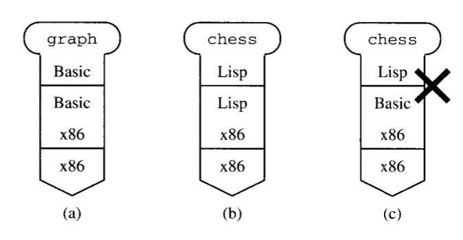

* * *

## 2.3 Real and abstract machines
인터프리터는 보통 고수준 언어를 해석하는 형태로 만들어진다. 그렇다고 저수준 언어를 해석하는 인터프리터가 사용되지 않는 것은 아니다.

아래와 같이 Ultima 기계어를 해석하는 인터프리터를 만들게 되면, 이는 실제 Ultima 기계와 동일하게 동작한다.  
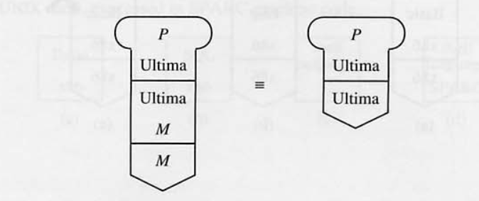  

이러한 인터프리터를 emulator라고 부른다. 그리고 때때로 인터프리터를 abstract machine이라고도 부르며 이와 counter-part로 하드웨어를 real machine이라고 한다.

이 내용들을 일반화 해보면 M 기계 위에서 구동되는 L 인터프리터는 L abstract machine이라고 봐도 무방하다.  

* * *

## 2.4 Interpretive compilers
컴파일러, 인터프리터의 장점을 섞은 Interpertive compiler라는 것이 있다. Interpertive compiler는 아래의 요건을 따르는 중간언어를 이용한다.

* 중간 언어는 소스 언어와 기계어 사이의 레벨에 해당하는 언어이다.
* 중간 언어의 명령어는 간단한 포멧을 갖기 때문에 쉽고 빠르게 분석 가능하다.
* 소스 언어에서 중간 언어로 쉽고 빠르게 변환 가능하다.

대표적인 예시 Java

JVM-code(img/intermediate laguage)는 객체 생성, 함수 호출, 어레이 인덱싱 등등의 자바 동작에 상응되는 명령어가 존재한다.

그렇기 때문에 Java -> JVM-code 컴파일이 빠르다. 그리고 JVM-code는 기계어와 비슷한 형식을 갖는다. 그렇기에 해석 동작 또한 빠르다.

## 2.5 Portable compilers
potability는 프로그램이 얼마나 변경 없이 다른 시스템에서 구동될 수 있는지를 나타낸다. 어떤 프로그램을 구현한 언어는 potability에 큰 영향을 주는 major factor이다.  

극단적 예시를 들자면 특정 시스템 assembly language(저수준 언어)로 표현된 프로그램은 코드를 새로 작성하지 않으면, 다른 시스템에선 구동 될 수 없다.  

high-level로 표현된 프로그램은 potability가 높다. 이상적으로 타겟 기계어만 다르게 컴파일 할 수 있다면 potability가 100%이다. 

하지만 실제론 다른 문자 집합, 다른 연산 방식으로 100%는 힘들고 95~99% potability를 달성할 수 있다.

Langauge Processor도 프로그램이기 때문에 Langauge Processor의 potability를 측정 할 수 있고, 일반 프로그램과 마찬가지로 구현 언어에 큰 영향을 받는다.  

해당 프로세서를 다른 머신에서 구동 시키는 것은 쉽지만, 다른 언어를 만들어내도록 하는 것은 쉽지 않다. (potability 개념은 다른 시스템에서  구동이기에 생성된 언어도 변경 되어야 한다.)

## 2.6 Bootstrapping
구현 언어와 소스 언어와 동일한 프로세서를 Bootstrapping이라고 한다.

### 2.6.1 Bootstrapping a portable compiler

### 2.6.2 Full bootstrap
프로그램은 프로그램을 작성한 언어에 의존적이다. 이러한 특성은 Langauge Processor에도 동일하게 적용되기에 특정 Langauge Processor가 다른 Langauge Processor에 의존적이게 되는 상황이 발생한다.

이러한 문제는 Langauge Processor를 그전 버전의 Langauge Processor로 만드는 full bootstrap 방식으로 해결 가능하다.  

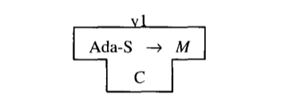  
v1의 Ada 컴파일러의 subset인 Ada-S 컴파일러를 만든다. 이때 구현 언어는 적절한 언어를 선택한다.

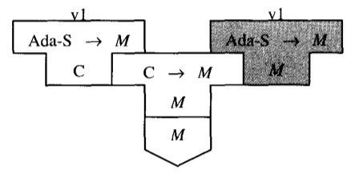  
그리고 v1 Ada-S 컴파일러는 C 컴파일러를 이용해 컴파일한다. v1은 C 컴파일러를 사용할 수 있는 시기까지만 유지보수가 가능하다.  

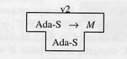  
이번엔 v2 Ada-S 컴파일러를 Ada-S를 통해 구현한다. 

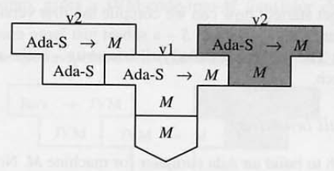  
이때 기존 v1 컴파일러로 v2 컴파일러를 컴파일 한다.

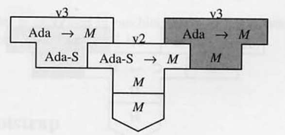  
마지막으로 기존 컴파일러를 full Ada 언어를 컴파일하도록 확장한다.

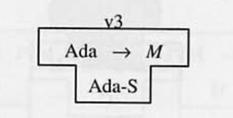  
그리고 기존 v2 컴파일러로 컴파일하면 온전한 Ada 컴파일러가 만들어진다.

이후 버전부턴 전버전 컴파일러로 새 버전 컴파일러를 컴파일하는 방식을 반복하면 된다.

### 2.6.3 Half bootstrap
구동 언어, 타겟 언어를 HM -> TM 으로 변경하는 것이 필요하다면, 컴파일러의 code generator를 수정해야한다. 해당 부분은 꽤 큰 영역을 담당하지만, 모듈화가 잘 되어 있다면 교체하는 일은 그리 큰일은 아니다.

이때 만약 컴파일러가 소스 언어와 구현 언어가 동일하다면, 위 작업을 half bootstrap 이라고 한다.

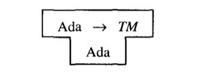  
Ada, Ada -> HM 컴파일러를 수정하여 Ada, Ada -> TM 컴파일러를 만든다.

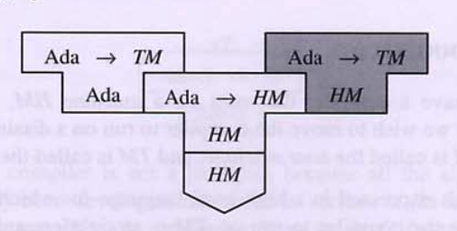  
기존 HM, Ada -> HM 컴파일러로 HM, Ada -> TM 컴파일러를 만든다.

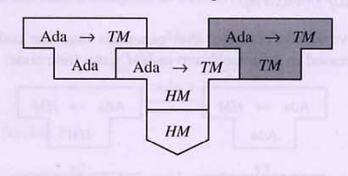  
마지막으로 아까 만든 Ada, Ada -> TM 컴파일러를 HM, Ada -> TM 컴파일러로 컴파일하여 TM, Ada -> TM을 완성한다.

### 2.6.4 Bootstapping to improve efficiency
컴파일러의 효율성은 여러가지 측면으로 측정될 수 있다. 컴파일러가 얼마나 효율적인 오브젝트 프로그램을 만들어 내는지도 그 중 하나다.

컴파일러는 효율적인 오브젝트 프로그램을 생산하도록 발전될 수 있는데, 이때 Bootstrapping을 사용하면 유용하다.
