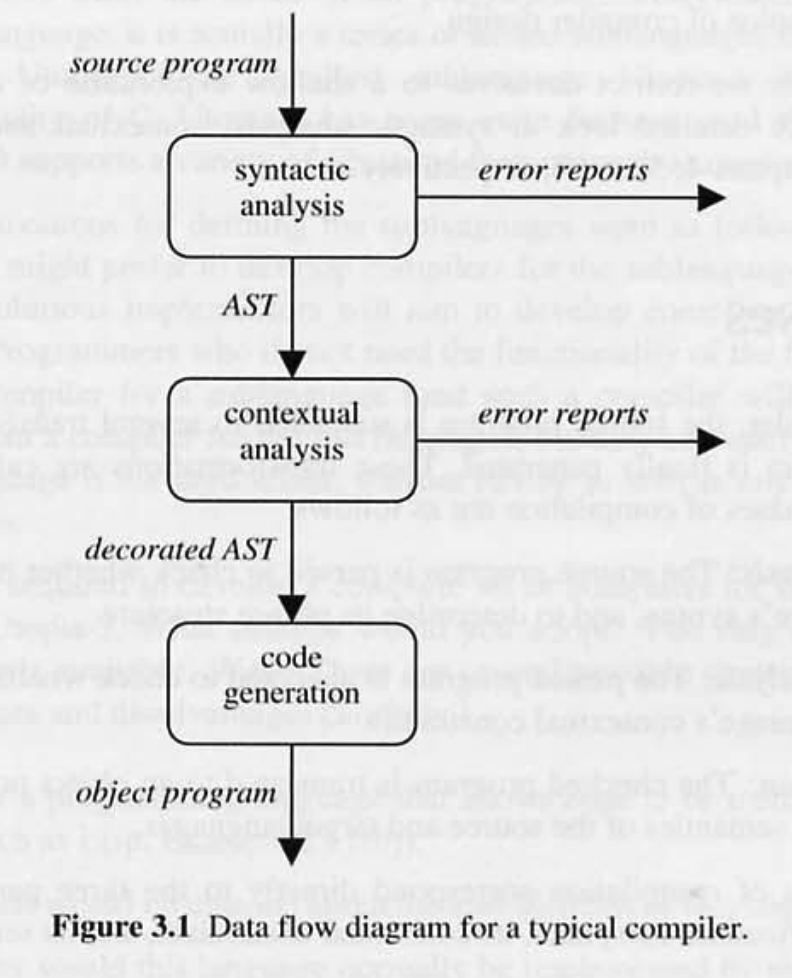
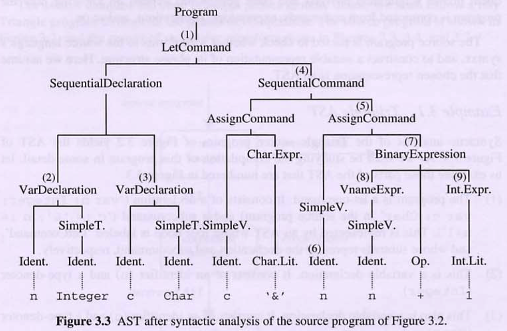
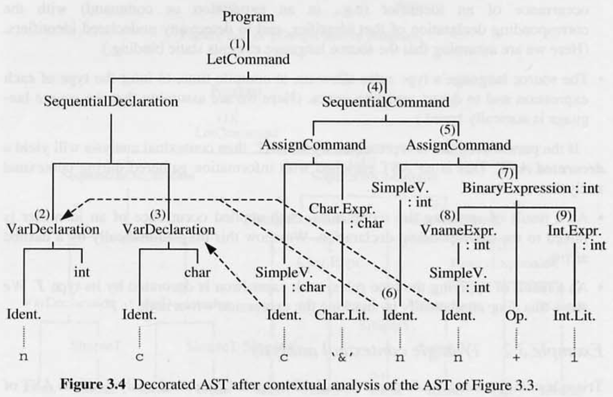
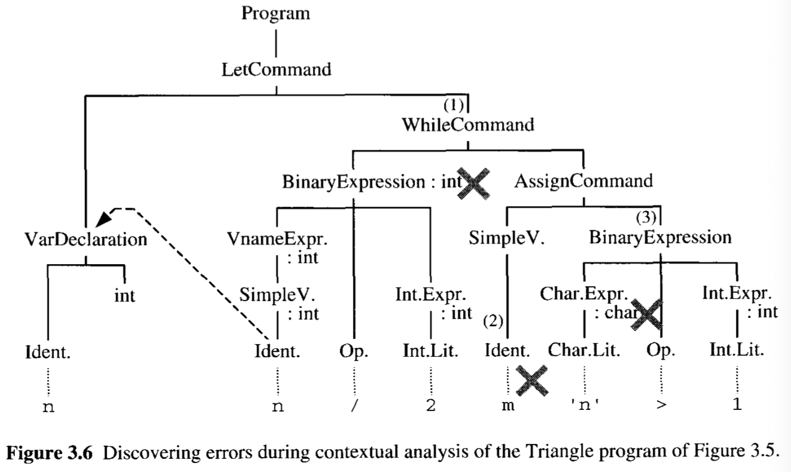
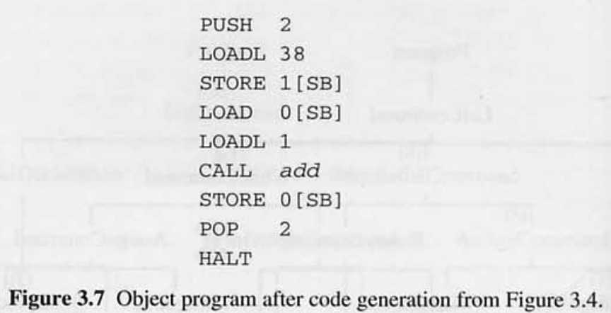
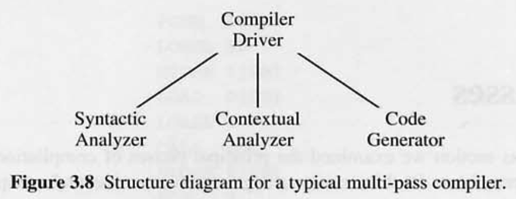
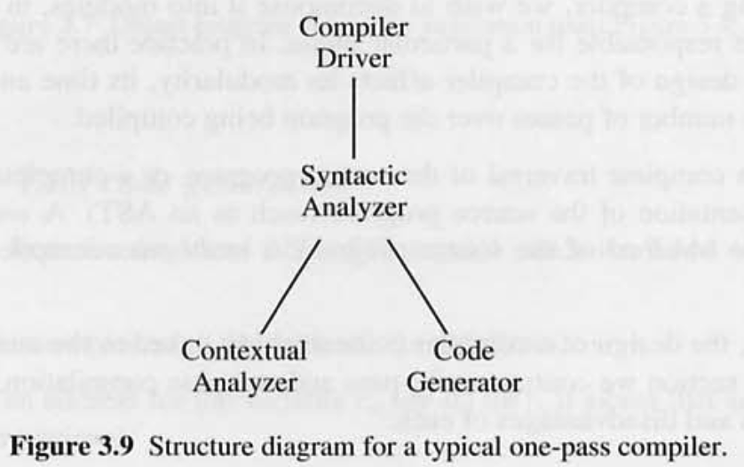
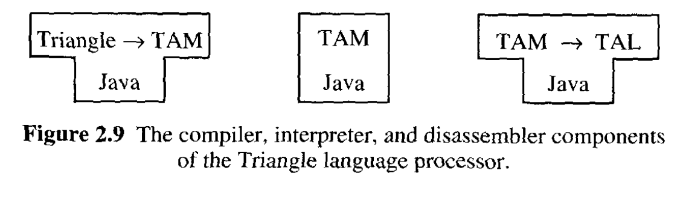
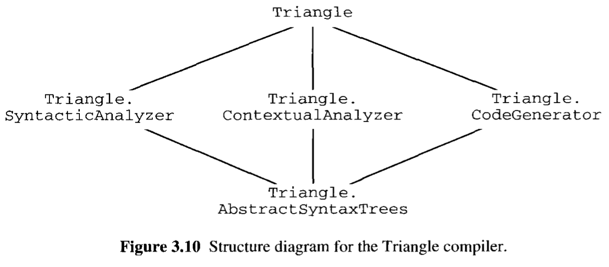

# 3. Compilation

## 이 장에서 배우는 것

- 컴파일 과정의 3단계 : 구문 분석, 문맥 분석, 코드 생성
- 컴파일러 설계 이슈

## 3.1 Phases

컴파일러 내부에서 소스 프로그램은 목적 프로그램이 생성되기 전에 몇가지 변환을 거친다.

이러한 변환들은 **페이즈 phases** 라고 부른다.

세 가지 주요 단계는 다음과 같다.

- 구문 분석 **Syntactic analysis** : 소스 언어의 구문을 준수하는지 확인하고, 구문 구조를 결정하기 위해 분석된다.
- 문맥 분석 **Contextual analysis** : 구문 분석이 완료된 프로그램은 소스 언어의 문맥적 제약 조건을 준수하는지 확인하기 위해 분석된다.
- 코드 생성 **Code generation** : 확인된 프로그램은 소스 및 목적 언어의 의미에 따라 목적 프로그램으로 변환된다.

컴파일의 세 가지 단계는 소스 언어 사양의 세 부분(구문, 문맥적 제약, 의미론)과 직접적으로 일치한다.

> 💡 일부 컴파일러는 네 번째 단계인 코드 최적화 <b>code optimization</b> 를 포함한다.  
> 어휘 분석 <b>Lexical analysis</b> 은 때때로 별개의 단계로 취급되지만, 이 책에서 우리는 그것을 구문 분석의 하위 단계로 취급할 것이다.

<br>

**AST 로 변환하는 이유 : 소스 프로그램의 구문 구조를 표현한다.**

- **서브트리**는 커맨드, 표현식, 선언 등과 일치한다.
- **리프노드**는 식별자, 리터럴, 연산자와 일치한다.
- **나머지 터미널 심볼**은 구문 분석 이후 지워질 수 있다.

일반적인 컴파일러의 흐름은 다음과 같다.



1. 구문 분석이 정상적으로 완료되면 **AST 를 생성**한다. 실패하는 경우 에러 리포트를 생성한다.
2. 문맥 분석이 정상적으로 완료되면 **decorated AST 를 생성**한다. 실패하는 경우 에러 리포트를 생성한다.
3. 코드 생성이 완료되면 **목적 프로그램을 생성**한다.

### 3.1.1 syntactic analysis

구문 분석의 목적은 **소스 프로그램의 구문 구조를 결정**하는 것이다. 이 과정을 파싱 **parsing** 이라고 한다.  
여기서는 구문 구조를 표현하는데 AST 를 사용한다고 가정한다.

#### Example 3.1 Triangle AST

- 소스 프로그램

```basic
! This program is useless
! except for illustration.
let
  var n: Integer;
  var c: Char
in
  begin
  c := '&';
  n := n + 1
  end
```

- 구문 분석의 결과로 생성된 AST



1. 이 프로그램은 `let-command` 이다. `declaration` 과 `subcommand` 로 구성된다.
2. `variable declaration` 이다. `identifier` 와 `type-denoter` 로 구성된다.
3. `variable declaration` 이다. `identifier` 와 `type-denoter` 로 구성된다.
4. `sequential command` 이다. 두 개의 `subcommand` 로 구성된다.
5. `assignment command` 이다. 좌측의 변수명(`variable name`)과 우측의 표현식(`expression`)으로 구성된다.
6. 변수명은 `identifier` 이다.
7. 두 개의 하위 `expression` 에 연산자(`operator`) ‘+’ 를 적용하는 `expression` 이다.
8. 이 표현식은 변수명이다.
9. 이 표현식은 정수형 리터럴(`integer-literal`)이다.

**AST 의 특징**

1. **리프노드**는 소스 프로그램의 `identifiers`, `literals`, `operators` 와 일치한다.
2. **서브트리**는 소스 프로그램의 구문으로 표현된다.
3. 빈 여백, 주석은 포함되지 않는다. → 프로그램에 영향을 주지 않기 때문.
4. 구두점, 괄호 또한 없다. → 프로그램의 구문을 구분하고, 둘러싸는 역할만 하기 때문.  
   (begin - end 괄호가 오직 시퀀셜 커맨드를 둘러싸는 용도로만 사용된다.)

구문 오류가 포함되어 있으면 적절한 구문 구조가 없다. 이 경우, 구문 분석에서 AST 를 생성하는 대신 에러 리포트를 생성한다.

## 3.1.2 Contextual analysis

파싱이 완료된 프로그램은 문맥 분석 단계에서 소스 언어의 문맥적 제약 조건에 부합하는지 여부를 판단하기 위해 추가로 분석된다.

- 컴파일 시, 소스 언어의 **scope rule** 을 통해,
  - 식별자(`Identifier`)의 각각의 `applied occurrence` 와 해당 식별자의 선언을 연결한다.
  - 선언되지 않은 모든 식별자를 탐지한다.
    (여기서는 소스 언어가 정적 바인딩을 한다고 가정한다.)
- 컴파일 시, 소스 언어의 **type rule** 을 통해, 각 표현식의 타입을 추론하고, 타입 오류를 감지한다.
- 문맥 분석이 완료되면 **decorated AST** 를 생성한다. **decorated AST** 에는 문맥 분석 중에 얻은 정보가 포함된다.
- **scope rule** 을 적용한 결과는 식별자의 각각의 적용 발생을 해당 선언에 연결한다.
  이것을 파선 화살표(`<- -`)로 표시한다.
- **type rule** 을 적용한 결과는 표현식의 루트 노드에 타입 T(`: T`) 로 표시한다.

### Example 3.2 Triangle contextual analysis



(2) 선언에 `int` 타입을 표시한다.

(3) 선언에 `char` 타입을 표시한다.

(6) 식별자 n 의 적용 발생과 선언을 연결한다.

(8) 표현식에 타입을 표시한다.

(9) 표현식에 타입을 표시한다.

(7) 연산자 ‘+’ 는 `int + int → int` 이므로, 양쪽 표현식이 `int` 타입인지 확인하고, 전체 식이 `int` 타입인지 추론한다.

(5) `AssignCommand` 의 좌측 변수와 우측 표현식이 동일한 타입인지 확인한다.

문맥 제약 조건에 적합하지 않으면 에러 리포트를 생성한다.

### Example 3.3 Detection of Triangle contextual errors

- 소스 프로그램

```basic
let
  var n: Integer
in
  ! ill-formed program
  while n / 2 do`
    m := 'n' > 1
```

- 소스 프로그램의 문맥 분석 중 감지된 위반 사항을 표현한 **decorated AST**



1. `whileCommand` 표현식이 bool 타입이 아니다. (type rule)
2. m 이 선언되지 않았다. (scope rule)
3. 연산자 ‘>’ 는 `int x int → bool` 이지만, 첫번째 하위 표현식이 잘못된 타입(`char`)이다. (type rule)

## 3.1.3 Code generation

코드 생성 단계에서는 검증된 소스 프로그램을 소스 및 목적 언어의 의미에 따라 목적 프로그램으로 변환한다.

코드 생성의 설계 이슈 : 소스 프로그램에서 선언 및 사용되는 식별자의 처리.

- **상수 선언 :** `const m ~ 7`
  - 식별자 m 을 값 7에 바인딩한다. 그 후, code generator 는 적용된 각각의 m 을 값 7로 대체한다.
- **변수 선언** : `var b: boolean`
  - 식별자 b 를 메모리 주소에 바인딩한다. 주소는 code generator 에 의해 결정된다.  
    그 후, code generator 는 적용된 각각의 b 를 바인딩 된 주소로 대체한다.

컴파일러 디자이너의 설계 이슈

- 컴파일러가 머신 코드를 생성해야 하는가, 타겟 머신의 어셈블리 언어를 생성해야 하는가?

### Example 3.4 TAM code generation

- 소스 프로그램

```basic
! This program is useless
! except for illustration.
let
  var n: Integer;
  var c: Char
in
  begin
  c := '&';
  n := n + 1
  end
```

- 목적 프로그램



line 2. ‘&’ 을 메모리에 로드.  
line 3. 1 [SB] 주소에 저장 - `c := ‘&’`  
line 4. 0 [SB] 의 값을 메모리에 로드.  
line 5. 1 을 메모리에 로드.  
line 6. add 명령어를 수행.  
line 7. 0 [SB] 주소에 저장 - `n := n + 1`


(2) 변수 n 에 0 [SB] 주소를 할당한다. 이후에 찾을 수 있도록 해당 주소를 노드 (2) 에 저장한다.

(3) 변수 c 에 1 [SB] 주소를 할당한다. 이후에 찾을 수 있도록 해당 주소를 노드 (3) 에 저장한다.

(8) ‘LOAD 0 [SB]’ 명령을 생성한다.

(9) ‘LOADL 1’ 명령을 생성한다.

(7) ‘CALL add’ 명령을 생성한다.

(5) ‘STORE 0 [SB] 명령을 생성한다.

이런 식으로 **code generator 는 전체 프로그램을 목적 코드로 변환한다.**

## 3.2 Passes

이번에는 이전에 배운 컴파일러 설계를 대체할 수 있는 컴파일러 설계를 검토하고 비교해본다.

컴파일러를 설계할 때, 각 모듈이 특정 단계를 책임지는 방식으로 분리한다.

컴파일러의 설계는 다음에 영향을 미친다.

- 모듈화
- 시간과 공간 요구 사항
- 컴파일되는 프로그램의 패스 횟수

### 3.2.1 Multi-pass compilation

최상위 모듈 **Compiler Driver** 과 하위 레벨의 세 가지 모듈로 구성된다.  
이전에 살펴본 방식과 동일하다.



### 3.2.2 One-pass compilation

구문 분석기가 문맥 분석기, 코드 생성기를 제어하는 구조이다.  
문맥 분석과 코드 생성이 구문 분석 중에 실행된다.  
구문이 파싱되자마자, 문맥 분석기가 검증하고, 목적 코드를 생성한다.  
그 후 다시 파싱이 재개된다.  
**즉, 코드를 한번만 읽고 번역한다.**



#### Example 3.5 One-pass compilation

```basic
! This program is useless
! except for illustration.
let
  var n: Integer  (1);
  var c: Char  (2)
in
  begin
  c  (3) := '&'  (4)(5);
  n  (6) := n + 1  (7)(8)
  end
```

코드 한 줄이 구문 분석이 완료되자마자, 문맥 분석 및 코드 생성이 즉시 실행된다.  
이후 다음 코드의 구문 분석을 다시 시작한다.

### 3.2.3 Compiler design issues

- Speed
  - One-pass 컴파일러가 우수함. → AST 의 순회 횟수와 속도가 비례하기 때문.
- Space
  - 컴파일러 자체의 메모리 사용량을 의미함.
  - One-pass 컴파일러가 더 많은 메모리를 차지함. → 모든 모듈이 메모리에 활성화되어 있기 때문.
- Modularity
  - Multi-pass 컴파일러가 모듈화가 잘 되어 있음. → One-pass 컴파일러의 구문분석기는 다른 모듈을 조작하기 때문.
- Flexibility
  - Multi-pass 컴파일러가 우수함. → 문맥 분석 및 코드 생성시 AST 를 보다 효율적인 순서로 순회할 수 있기 때문.  
    더 효율적인 목적 코드를 생성할 수 있음.
- Sementics-preserving Transformations (의미 보존 변환?)
  - 코드 최적화에 해당하는 듯함.
  - 전체 구조를 분석하고 최적화 해야 하기 때문에 Multi-pass 컴파일러 설계가 필요함.
- Source language properties
  - 사용 하기 전에 식별자를 선언해야 하는 경우는 One-pass 컴파일러를 사용할 수 있다.
    - Pascal, Ada, Triangle 같은 언어
  - 사용 하기 전에 식별자를 선언할 필요가 없는 경우는 Multi-pass 컴파일러가 필요하다.
    - Java, ML

#### Example 3.6 Pascal compiler design

파스칼은 사용하기 전에 식별자를 선언해야 한다.

따라서 식별자의 적용 발생시, 이전에 분석된 결과를 이용해서 선언이 이미 처리 됐는지, 누락되었는지 판단 가능.

```pascal
var n: Integer;

procedure inc;
  begin
  n := n + 1
  end;

begin
n := 0; inc
end
```

#### Example 3.7 Java compiler design

변수를 사용 하기 전에 식별자를 선언할 필요가 없는 자바에서는 상황이 다르다. 아래의 자바 코드는 잘 작성되었다.

```java
class Example {
  void inc() { n = n + 1; }
  int n;
  void use() { n = 0; inc(); }
}
```

`n = n + 1;` 구문은 `int n;` 구문 처리 전에 수행 할 수 없다.  
**따라서 변수 선언을 하나의 패스로 처리하고, 메서드 본문 내부의 표현식들은 이후 패스에서 처리한다.**

## 3.3 Case study: the Triangle compiler

2.7 케이스 스터디 섹션에서 설명했듯이, Triangle 언어 프로세서는 컴파일러, 인터프리터, 디어셈블러로 구성된다. 여기서는 Triangle 컴파일러에 대해 더 자세히 알아본다.



Multi-pass 설계로 된 **Compiler driver**

```java
public class Compiler {
	public static void compileProgram(...) {
		Parser parser = new Parser(...);
		Checker checker = new Checker(...);
		Encoder generator = new Encoder(...);

		Program theAST = parser.parse();

		checker.check(theAST);

		generator.encode(theAST);
	}

	public static void main(String[] args) {
		...
		compileProgram(...);
	}
}
```

<br>

컴파일러 구조 다이어그램



- 패키지 구조 간략 설명

- Triangle.AbstractSyntaxTree
  - AST 데이터 구조를 정의하는 클래스를 포함.
- Triangle.SyntacticAnalyzer
  - `Parser` 클래스를 포함.
- Triangle.ContextualAnalyzer
  - `Checker` 클래스를 포함.
- Triangle.CodeGenerator
  - `Encoder` 클래스를 포함.
- Triangle
  - `Compiler` 클래스를 포함.

## 참고

[What is the difference between One-Pass Compiler and Multi-Pass Compiler?](https://www.tutorialspoint.com/what-is-the-difference-between-one-pass-compiler-and-multi-pass-compiler)
