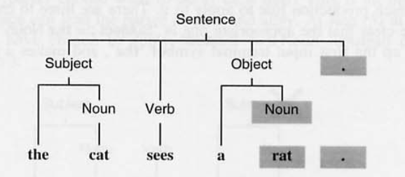

# Syntatic Analysis

## 4.1 Subphases of syntactic analysis
컴파일러 구문 분석은 아래와 같은 하위 과정으로 이뤄진다.

* Scanning(or lexical analysis): 소스 프로그램 이 토큰의 스트림으로 변환하는 단계를 말한다. 이때 주석, 토큰 사이의 빈칸 들과 같은 필요 없는 요소는 버려진다.

* Parsing: 구문 구조를 결정하기 위해 소스 프로그램을 파싱하는 단계를 말한다.

* Representation of the phrase structure: 소스 프로그램의 구문 구조를 데이터 구조를 통해 나타내는 단계를 말한다. 이때 보통 AST가 사용된다.

### 4.1.1 Tokens
*토큰(Token)* 은 Scanner와 Parser 사이의 인터페이스이다.

'Scanner' - Token > 'Parser'

토큰은 원자적 심볼. -> 의미 확인??

소스 프로그램은 토큰, 빈칸, 주석으로 이뤄진다. 하지만 
블랭크, 주석 자체는 토큰은 아니다.

토큰은 용도에 따라 분류될 수 있다. 
* 식별자
* 리터럴
* 오퍼레이터 

같은 종류의 토큰은 다른 것으로 변경되어도 프로그램 구문 구조에 영향을 끼치지 않는다.

```
// 아래 서로 다른 토큰으로 이뤄져 있지만, 두 구문은 같은 구조이다.
var a : String
var b : Int
```
  

### Example 4.2 Token of Mini-Triangle
각 토큰은 종류와 스펠링으로 완벽히 묘사 가능하다.

```
class Token(
    val kind : Kind
    val spelling : String
) {
    enum class Kind {
        IDENTIFIER,
        INTLITERAL,
        OPERATOR,
        BEGIN,
        CONST,
        DO,
        ELSE,
        END,
        IF,
        IN,
        LET,
        THEN,
        VAR,
        WHILE,
        SEMICOLON,
        BECOMES,
        IS,
        LPAREN,
        RPAREN,
        EOT
    }
}
```

각 토큰의 타입은 Parser에 의해 검사되며, 같은 타입의 다른 토큰은 구조엔 영향이 없다.

스펠링은 문맥검사 혹은 코드 제네레이터 단계에서 판단되는데, 이를 위해 스펠링 정보는 AST 만드는데까지 유지 되어야 한다.

## 4.2 Grammers revisited

### 4.2.1 Regular expressions
*정규식(Regular expressions)* 은 터미널 심볼의 조합을 표현하기 좋은 표기법이다.
주로 아래와 같은 기능이 있다.

> `A | B` : A 대신 B 가능
>
> `A*` : A가 0번 이상 반복될 수 있음
>
> `(`, `)` : 그룹핑

---

  
* empty : 빈 문자열
* singletone : 터미널 심볼
* concatienation : 'A 'B' > 'AB'
* alternative : 'A' | 'B' > 'A' or 'B'
* iteration : X, XX, XXX, XXXX ...
* grouping : ('XY')* > XY, XYXY, XYXYXY ...

### Example 4.3 Regular expressions

> 'M' 'r' | 'M 's' - {'Mr', 'Ms'}
>
> 'M' ('r'|'s') - {'Mr', 'Ms'}
>
> 'p' 's'* 't' - {pt, pst, psst, ... }
> 
> 'b' 'a' ('n' 'a')* - {'ba', 'bana', 'banana' ... }
>
> 'M' ('r'| 's')* - {'M', 'Mr', 'Ms', 'Mrr', 'Mrs', 'Msr', 'Mss' ... }

* Regular Language로는 간단한 언어만 표현 가능하다.
* Programming Language처럼 복잡하고 'self-embedding(자가 포함)' 문법을 갖는 언어는 정규식만으로 표현 불가능 하다.

*자가 포함 예시*
1. 표현식 `'a * (b + c) / d'` 내부에 `(b + c)` 존재 가능.
2. 커맨드 `if x > y then m := x else m := y` 내부에 `m := x` 커맨드 존재 가능.

프로그래밍 언어는 정규식만으로 표현이 불가능하며, BNF, EBNF를 이용해 재귀적 표현을 명시해야 함

### 4.2.2 Extended BNF
*EBNF = BNF + RE*

`N ::= X` 

여기서 `N`은 논터미널 심볼, `X`는 터미널 심볼과 논터미널과 정규식 조합 구성됨

### Exmaple 4.4 Grammar expressed in EBNF

```
Expression          ::= primary-Expression(Operator primary-Expression)*

primary-Expression  ::= Identifier
                    | ( Expression )

Identifier          ::= a | b | c | d | e

Operator            ::= + | - | * | /
```

```
e 
`Expression` > `primary-Expression` > `Identifier`

a + b
`Expression` > `primary-Expression` `Operator` `primary-Expression` >
`Identifier` `Operator` `Identifier`

a + (b * c)
`Expression` > `primary-Expression` `Operator` `primary-Expression` >
`primary-Expression` `Operator` `(Expression)` >
`primary-Expression` `Operator` (`primary-Expression` `Operator` `primary-Expression`) >
`Identifier` `Operator` (`Identifier` `Operator` `Identifier`)
```

### 4.2.3 Grammar transformations

> Left factorization
>
> `X Y | X Z` == `X (Y | Z)`

### Example 4.5 Left factorization
```
single-Command ::= V-name := Expression
                | if Expression then single-Command
                | if Expression then single-Command
                    else single-Command

// Left factorization 적용
single-Command ::= V-name := Expression
                | if Expression then single-Command
                    (e | else single-Command)
```

> Elimination of left recursion
>
> `N ::= X | N Y` == `N ::= X(Y)*`

```
N Y > (N Y) Y > (N Y) Y Y > ... > XYYYYY => X(Y)*
```

### Example 4.6 Elimination of left recursion

```
Identifier ::= Letter
            | Identifier Letter
            | Identifier Digit

// Left factorization 적용
Identifier ::= Letter
            | Identifier (Letter | Digit)

// Elimination of left recursion 적용
Identifier ::= Letter (Letter | Digit)*
```

### Example 4.7 Substitution
```
single-Command      ::= for Control-variable := Expression To-or-Downto
                            Expression do single-Command
                    | ...

Control-Variable    ::= Identifier

To-or-Downto        ::= to
                    | downto

// Substitution 적용
single-Command      ::= for Identifier := Expression (to | downto)
                            Expression do single-Command
```
*치환(Substitution)* 을 통해 불필요한 논터미널 심볼을 제거 할 수 있다.

### 4.2.4 Starter sets
starters[[X]]는 X의 구문구조들의 첫 터미널 심볼의 집합
```
Subject             ::= I | a Noun | the Noun
starters[[Subject]] > {I, a, the}
```

## 4.3 Parsing
*파싱(Parsing)* 은 스캐닝 단계에서 얻어진 토큰 스트림을 통해 구문 구조를 발견하는 단계를 말한다. 

* Recognition: 입력된 문자열이 어떠한 문법의 문장이 될 수 있는 지 결정
* Parsing: 입력된 문자열을 인식에 더해 구문 구조를 결정하는 것이다. 구문 구조는 신택스 트리로 표현 된다.

파싱 알고리즘은 여러가지 존재하지만, 이장에선 기본적인 아래의 2가지 알고리즘을 다룬다.

*bottom-up parsing(상향식 파싱)*

*top-bottom parsing(하향식 파싱)*

### Example 4.8 Grammar of micro-English
   

 ```
 the cat sees a rat. // OK
 like cat. // Error
 ```

 ### 4.3.1 The bottom-up parsing strategy
 ### Example 4.9 Bottom-up parsing of micro-English
 ```
the cat sees a rat .
```
  
(1) 'the'로 이동 > 파서는 아직 아무것도 알 수 없다. > 'cat'로 이동 > 프로덕션 룰 'Noun ::= cat' 적용 가능 > cat을 하위 트리로 하는 Noun 트리 생성 

  
(2) Subject ::= 'the' Noun 적용 가능 > Subject 트리 생성

  
(3) 'sees'로 이동 > 'Verb ::= sees'룰 적용 > Verb 트리 생성

  
(4) 'a'로 이동 > 할 수 있는 것 없음 > 'rat'로 이동 > Noun룰 적용 > Noun 트리 생성

  
(5) Object룰 적용 > Object 트리 생성

  
(6) '.' 이동 > Sentence 룰 적용 > Sentence 트리 생성

일반적으로 상향식 파서는, 프로덕션룰의 오른쪽과 매칭되는, 터미널 심볼, 트리를 마주 했을때, 상위 트리로 조합된다.

(5)단계에서 Object가 아닌 Subject로 Tree를 만들었다면, 문제가 생긴다. 이렇게 각 단계에서 어떤 프로덕션 룰을 적용할지에 대해 상향식에선 판단하기 힘들다.

### 4.3.2 The top-down parsing strategy

### Example 4.10 Top-down parsing of micro-English
```
the cat sees a rat .
```

  
(1) 먼저 문장 노드에 적용할 룰을 찾는다 > 여기선 1개이므로, `Sentence ::= Subject Verb Object.`

  
(2) 문장 구성의 제일 왼쪽부터 찾는다. > Subject를 구성할 수 있는 3가지 룰중 `the Noun`이 명백하므로 선택 

  
(3) 다음은 Noun을 구성하기 위한 값을 찾는다. > `Noun ::= Cat` > 트리 구성

  
(4) `Verb ::= sees` > 트리 구성

  
(5) `Object ::= a Noun` > 트리 구성

  
(6) `Noun :: = rat` > 트리 구성 > `'.'` 만나서 끝

하향식은 상향식과 같이 프로덕션 룰을 어떤것으로 적용할지 정하기 위해 이전 값들을 확인할 필요가 없다.

### 4.3.3 Recursive-decent parsing

### Example 4.11 Recursive-descent parser for micro-English

```
class Parser(
    val symbols: Queue<String>
) {
    var currentSymbol : String? = symbols.poll()

    private fun accept(expected: String) {
        if(currentSymbol == expected) {
            currentSymbol = nextInput()
        } else {
            throw java.lang.RuntimeException()
        }
    }

    private fun nextInput(): String? {
        return symbols.poll()
    }

    fun parseSentence () {
        parseSubject()
        parseVerb()
        parseObject()
        accept(".")
        if(currentSymbol == null) {
            println("compile complete")
        } else {
            println("compile error")
        }
    }

    private fun parseSubject() {
        if (currentSymbol == "I") {
            accept("I")
        } else if(currentSymbol == "a") {
            accept("a")
            parseNoun()
        } else if (currentSymbol == "the") {
            accept("the")
            parseNoun()
        } else {
            throw java.lang.RuntimeException()
        }
    }

    private fun parseNoun() {
        if (currentSymbol == "cat") {
            accept("cat")
        } else if(currentSymbol == "mat") {
            accept("mat")
        } else if(currentSymbol == "rat") {
            accept("rat")
        } else {
            throw java.lang.RuntimeException()
        }
    }

    private fun parseVerb() {
        if (currentSymbol == "like") {
            accept("like")
        } else if(currentSymbol == "is") {
            accept("is")
        } else if(currentSymbol == "see") {
            accept("see")
        } else if(currentSymbol == "sees") {
            accept("sees")
        } else {
            throw java.lang.RuntimeException()
        }
    }

    private fun parseObject() {
        if (currentSymbol == "me") {
            accept("me")
        } else if(currentSymbol == "a") {
            accept("a")
            parseNoun()
        } else if(currentSymbol == "the") {
            accept("the")
            parseNoun()
        } else {
            throw java.lang.RuntimeException()
        }
    }
}
```

Parser는 syntax tree를 만들지는 않지만, Parser 내부 함수 호출 구조가 tree와 동일하기에 만들떄 사용될 수 있다.

### 4.3.4 Systematic development of a recursive-descent parser

(1) 문법을 EBNF로 표현한다. 문법 변환을 통해 정리
(2) 각 룰을 parse메서드로 변경
(3) Parser 생성

### Example 4.12
1. EBNF 정리
```
Command         ::= single-Command
                |   Command ; single-Command

// left recursion & Substitution
Command         :: single-Command(; single-Command)*
```

2. parsing method 구현
```
private fun parseProgram()
private fun parseCommand()
private fun parseSingleCommand()
private fun parseExpression()
private fun parsePrimaryExpression()
private fun parseDeclaration()
private fun parseSingleDeclaration()
```

```
private fun parseSingleDeclaration() {
    when(currentToken.kind) {       // single-declaration ::=
        Token.CONST -> {            
            acceptIt()              // const
            parseIdentifier()       // identifier
            accept(Token.IS)        // ~
            parseExpression()       // Expression
        }
    }
    ... 
}
```

```
private fun parseCommand() {            // Command ::=
    parseSingleCommand()                // single-command
    when(currentToken.kind) {       
        Token.SEMICOLON -> {            // (
            acceptIt()                  // ;
            parseSingleCommand()        // single-command
        }                               // )*
    }
    ... 
}
```
3. Parser 구현

유의
* 토큰의 타입만 체크해야한다. 스펠링은 무시
* 프로그램끝에 EOT가 오는지 확인
* 각 구문분석 함수는 상호 재귀적이다.

위에서 작업했던 recursive-descent parser 개발 방법을 일반화

  

`starters[[X]]`로 프로덕션 룰 찾음

---------------------
*LL grammar*
* X | Y 문법이 있다면, stater X stater Y는 겹치면 안됨
* X*는 X* 토큰 셋과 겹치면 안됨
위의 조건을 만족하는 문법을 LL grammar라고 부른다.

