# 5. Contextual analytics

컴파일시, 소스 언어의 문맥적 제약 조건과 일치하는지 검증하기 위해 **문맥 분석**을 수행한다.

일반적인 프로그래밍 언어(정적 타입, 정적 바인딩)에서 문맥 분석은 다음의 규칙을 따른다.

- **Scope rules** : 선언과 식별자의 적용 발생을 제어하는 규칙.
- **Type rules** : 표현식의 타입을 추론하고, 각 표현식에 올바른 타입이 있는지 여부를 결정하는 규칙.

문맥 분석은 2개의 하위 단계로 구성된다.

- **Identification** : 소스 언어의 스코프 룰을 적용하여 각각의 식별자의 적용 발생과 선언을 연결한다.
- **Type checking** : 소스 언어의 타입 룰을 적용하여 각 표현식의 타입을 추론하고, 예상한 타입과 비교한다.

---

**3장의 내용.**

- 컴파일 시, 소스 언어의 **scope rule** 을 통해,
  - 식별자(`Identifier`)의 각각의 `applied occurrence` 와 해당 식별자의 선언을 연결한다.
  - 선언되지 않은 모든 식별자를 탐지한다.
    (여기서는 소스 언어가 정적 바인딩을 한다고 가정한다.)
- 컴파일 시, 소스 언어의 **type rule** 을 통해, 각 표현식의 타입을 추론하고, 타입 오류를 감지한다.

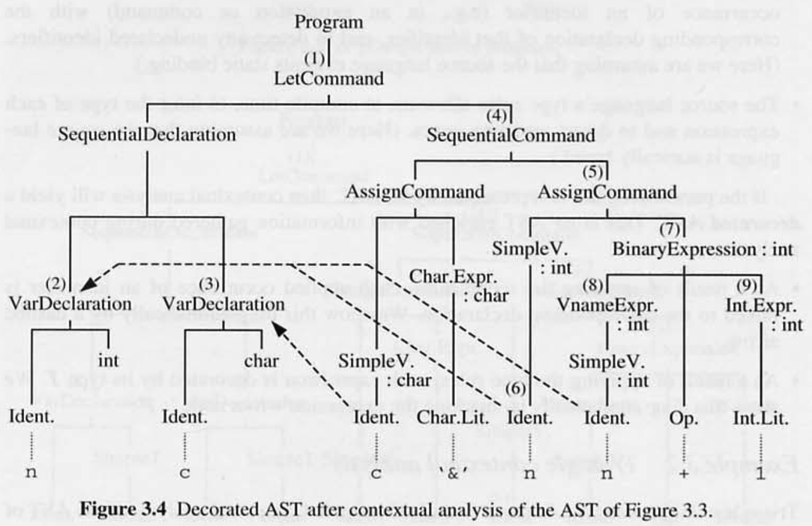

---

5.1 섹션에서 `Identification`, `type checking` 을 학습한다.

5.3 섹션에서 `Identification` 과 `type checking` 을 **단일 패스로 결합하는 특정 문맥 분석 알고리즘**을 개발하고, 문맥 분석의 결과가 어떻게 기록 될 수 있는지 확인 해본다.

## 5.1 Identification

식별자의 적용 발생과 일치하는 선언을 연결하는데, 이때, 일치하는 선언이 없다면, 소스 프로그램이 적합하지 않으므로 에러 리포트를 생성한다.

식별자의 적용 발생이 선언과 일치하는 것으로 식별되면, 식별자는 선언과 일치하는 방식으로 사용된다.

```kotlin
var *a*: *Int* = 3

fun main() {
	val b = 10 - *a  // a 는 integer variable 로 사용됨.*
}
```

`Identification` 은 전체 컴파일러의 효율성에 불균형한 영향을 미칠 수 있다. 더 큰 소스 프로그램은 더 많은 식별자의 적용 발생을 포함하므로 더 많은 `Identification` 을 수행해야 한다.

긴 소스 프로그램은 더 많은 선언을 포함하고 있으므로, 각각의 식별은 더 많은 시간이 걸릴 수 있다 - 특히 식별이 단순하게 구현된다면, 일부 컴파일러는 이로 인해 매우 느리다.

bottom-up 방식의 매우 단순한 식별 알고리즘으로 AST 를 탐색하면 매우 복잡하고 느릴 것이다. (Exercise 5.5 참고.)

더 나은 방법은 **식별자와 속성을 연결한 식별 테이블**을 사용하는 것이다. 기본적인 명령은 다음과 같다.

- 비어있는 식별 테이블 생성.
- 지정된 식별자와 속성을 연결한 엔트리 추가.
- 지정된 식별자와 관련된 속성(존재하는 경우)을 검색.

식별자의 속성은 **문맥 분석에 관련된 정보**이고, 식별자의 선언으로부터 얻는다.

속성은 선언에서 추출할 수 있거나, 선언 자체에 대한 포인터이다.

속성이 식별 테이블의 구조에 영향을 미치지 않기 때문에 현재로서는 구체적일 필요가 없다. 5.1.4 섹션에서 다시 볼 것이다.

프로그램에서 각각의 선언에는 선언이 적용되는 프로그램의 부분적인 구체적 범위가 있다.

**블록**은 그 안에서 선언의 범위를 한정하는 프로그램 구문이다.

예를 들어, Triangle 은 `Let D in C` 형식의 블록 명령을 가지고 있는데, 여기서 D 의 각 선언의 범위는 하위 명령 C 로 확장된다.

식별 테이블의 구성은 소스 언어의 블록 구조에 따라 달라지는데, 블록 구조는 프로그램에서 블록들의 원문의 관계이다.

블록 구조는 3가지가 있다.

- 모놀리식 블록 구조 (ex. Basic, Cobol)
- 플랫 블록 구조 (ex. Fortran)
- 중첩된 블록 구조 (ex. Pascal, Ada, C, Java)

### 5.1.1 Monolithic block structure

**하나의 블록이 전체 프로그램**이라면 프로그래밍 언어는 모놀리식 블록 구조를 나타낸다. 전체 선언은 글로벌 스코프가 된다.

일반적으로 모놀리식 블록 구조의 스코프 룰은 매우 단순하다.

1. 식별자를 두 번 이상 선언 불가.
2. 모든 식별자의 적용 발생은 선언과 일치해야 한다. (식별자를 선언하지 않고 사용 불가)

모놀리식 블록 구조에서, 식별 테이블은 소스 프로그램의 모든 선언의 엔트리를 포함해야 한다. 각 식별자에 대해 최대 하나의 엔트리가 있을 것이다. 각 엔트리는 식별자 _I_ 와 속성 _A_ 로 구성된다.

**Example 5.1 Monolithic block structure**

```basic
program
	D    ! sequence of declarations
begin
	C    ! command sequence
end
```

하나의 블록이 전체 프로그램이다.

그림 5.1 은 모든 선언이 처리된 후 식별 테이블의 그림과 함께 프로그램의 개요를 보여준다. 테이블에는 선언된 각 식별자에 대해 하나의 항목이 포함되어 있다.

소스 프로그램의 선언에는 상호 참조를 위해 번호가 매겨지며, 테이블의 각 식별자의 속성은 식별자의 선언에 대한 상호 참조로 표시된다.

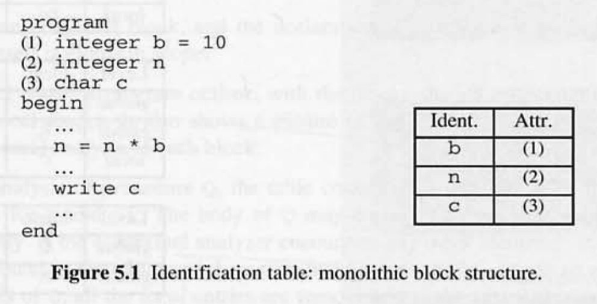

자바 클래스로 다음과 같이 정의할 수 있다.

```java
public class Attribute {
	... // Attribute details.
}

public class IdentificationTable {

	... // Variables representing the identification table.

	public IdentificationTable() {
		// make an empty identification table.
		...
	}

	public void enter(String id, Attribute attr) {
		// Add an entry to the identification table, associating identifier id
		// with attribute attr.
		...
	}

	public Attribute retrieve(String id) {
		// Return the attribute associated with identifier id in the identifiation
		// table. If there is no entry for id, return null.
		...
	}
}
```

식별자가 적용될 때, `retrieve` 메서드를 통해 식별자의 선언에 대한 엔트리를 찾지 못 한다면, 에러 리포트를 생성한다.

효율적인 검색을 위해 식별 테이블을 구조화해야 한다. 좋은 구현 방식은 이진 탐색 또는 해시 테이블과 같은 구조일 것이다. (Exercise 5.1.)

### 5.1.2 Flat block structure

**프로그램이 여러개의 분할된 블록들로 분리**될 수 있다면 플랫 블록 구조를 나타낸다.

- 특정 선언은 local 스코프이다. 지역적으로 선언된 식별자의 적용 발생은 특정 블록으로 제한된다.
- 이외의 선언은 global 스코프이다. 프로그램의 어디서든 식별자의 적용 발생이 허용된다. 사실상, 프로그램 전체가 다른 모든 블록들을 둘러싸는 블록이다.

플랙 블록 구조의 스코프 룰은 다음과 같다.

1. 전역적으로 선언된 식별자는 여러번 선언 될 수 없다. (지역적으로는 동일한 식별자를 선언할 수 있다.)
2. 지역적으로 선언된 식별자는 동일한 블록에서 여러번 선언 될 수 없다. (다른 블록에서는 가능하다.)
3. 블록 _B_ 의 모든 식별자의 적용 발생 _I_ 는 _I_ 의 선언과 일치해야 한다.
   이 때 선언은 _I_ 의 전역 선언이거나, _B_ 에 대한 _I_ 의 지역 선언이어야 한다.

플랫 블록 구조에서 식별 테이블은 전역 또는 지역 선언에 대한 정보를 포함해야 한다.

테이블의 내용은 문맥 분석 중에 달라진다. 블록 _B_ 를 분석하는 동안 테이블에는 전역 선언과 블록 _B_ 의 지역 선언에 대한 엔트리가 모두 포함되어야 한다. 블록 _B_ 에 대한 분석이 완료되면, 지역 선언에 대한 엔트리는 폐기해야 한다.

따라서 지역 및 글로벌 선언 된 엔트리는 어떤 방식으로든 구별이 되어야 한다.

**Example 5.2 Flat block structure**

메인 프로그램의 구조는 다음과 같다.

```fortran
program
	D
begin
	C
end
```

프로시저의 구조는 다음과 같다. **프로시저의 선언 자체는 전역적이다.**

```fortran
procedure I
	D
begin
	C
end
```

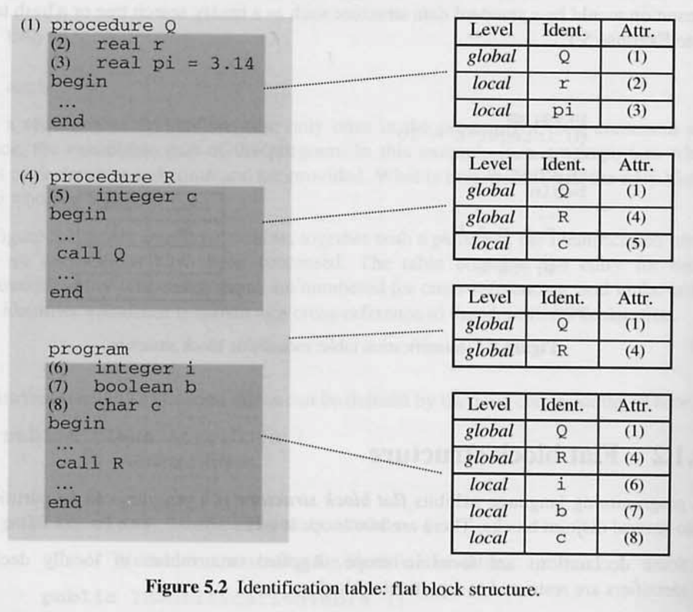

그림 5.2 를 보면 소스 프로그램의 전역 범위와 지역 범위가 구분되어 있다.

각 블록의 문맥 분석 중에 있는 식별 테이블의 그림도 순차적으로 표시되어 있다.

프로시저 Q 를 분석하는 동안 테이블에는 Q 에 대한 전역 선언과 지역 선언이 포함되어 있다.

Q 를 분석한 후, 테이블에서 모든 지역 엔트리를 제거한다.

프로시저 R 과 프로그램에 동일한 식별자 c 에 대한 지역 선언이 포함되어 있지만, 서로 다른 블록에 대한 지역 선언이기 때문에 혼동을 일으키지 않는다.

이제 식별 테이블의 탐색 함수는 좀 더 복잡한 사양을 필요로 한다.

```java
public void openScope() {
	// 지역 범위 레벨을 식별 테이블에 추가한다.
	// 아직 엔트리가 테이블에 속하지 않는다.
}

public void closeScope() {
	// 식별 테이블에서 지역 범위 레벨 및 지역 범위 레벨에 포함되는 엔트리를 모두 제거한다.
	...
}
```

블록이 시작 될 때 `openScope` 메서드를 호출한다. 블록이 끝나면 `closeScope` 메서드를 호출한다.

`openScope` 메서드가 호출 됐지만 `closeScope` 메서드에 의해 취소되지 않은 경우, 새 엔트리는 `local` 로 표시되고 그렇지 않으면 `global` 로 표시된다.

### 5.1.3 Nested block structure

**블록들이 다른 블록 내부에 포함** 될 수 있다면 중첩된 블록 구조를 나타낸다.

- 가장 바깥쪽 블록 안의 선언은 전역 범위이다. 이러한 블록은 _level 1_ 이라고 한다.
- 내부에 있는 블록 안의 선언은 해당 블록의 지역 범위이다. 내부로 들어갈수록 _level 2_, _level 3, …_ 이라고 한다.

일반적으로 내포된 블록 구조를 가진 언어의 스코프 룰은 다음과 같다.

- 동일한 블록에서 식별자가 여러번 선언될 수 없다. (다른 블록 및 중첩된 블록에서는 동일한 식별자를 선언할 수 있다.)
- 블록 _B_ 에서 식별자 _I_ 가 적용될 때마다 _I_ 의 선언이 있어야 한다. 이 선언은 _B_ 자체에 있어야 하고, 그렇지 않으면 _B_ 를 곧바로 둘러싸는 _B'_ 블록에 있어야 하며, 그렇지 않으면 _B'_ 를 곧바로 둘러싸는 _B'’_ 블록에 있어야 한다. (즉, 해당 선언은 _I_ 을 포함하여 둘러싸는 가장 작은 블록에 있어야 한다.)

중첩된 블록 구조의 경우, 식별 테이블에 모든 범위 레벨의 선언에 대한 엔트리가 포함되어야 한다.

테이블의 항목들은 문맥 분석 도중에 달라진다.

블록 _B_ 를 분석하는 동안 테이블에는 _B_ 의 선언에 대한 항목, _B_ 를 둘러싸는 블록 _B'_ 의 선언에 대한 항목, _B'_ 를 둘러싸는 블록 _B'’_ 의 선언에 대한 항목 등이 포함되어야 한다. B 에 대한 분석이 완료되면, B 의 선언에 대한 항목은 폐기되어야 한다.

이렇게 하려면 **각 항목에 범위 수준 번호**가 포함되어야 한다.

**Example 5.3 Nested block structure**

Mini-Triangle 언어의 블록 커맨드는 다음과 같다. 이 명령은 중첩이 가능하다.

```java
let
	D
in
	C
```

그림 5.3 을 보면, 블록 레벨에 따라 구분이 되어있다.

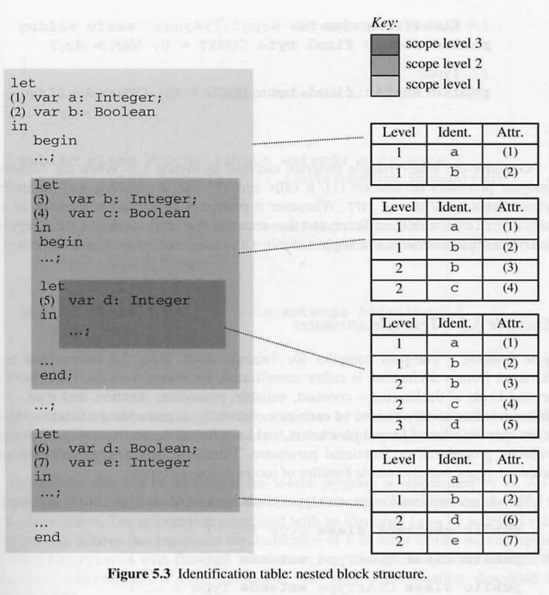

- 가장 바깥쪽 블록에 선언된 식별자 a, b 는 _level 1_ 로 표시된다.
- 그 다음 내부 블록에 선언된 식별자 b, c 는 _level 2_, 그 다음 내부 블록에 선언된 식별자 d 는 _level 3_ 으로 표시된다. _level 1_ 과 _level 2_ 에 선언된 식별자 b 는 다른 블록에서 선언되었으므로 타당하다.
- 가장 안쪽 블록에 식별자 b 가 적용된 경우, 두번째 스코프 룰에 따라 속성을 검색해야 한다.

식별 테이블은 이전에 구현한 형태와 동일하지만, 변경된 사양이 있다.

```java
public Attribute retrieve(String id) {
	// 식별 테이블의 식별자 id 와 연결된 특성을 반환한다.
	// id 에 대한 항목이 없으면 가장 높은 범위 레벨의 엔트리에서 속성을 반환한다.
	// 마지막으로, id 에 대한 항목이 없으면 null 을 반환한다.
	...
}

public void openScope() {
	// 식별 테이블에 가장 높은 새 범위 레벨을 추가한다.
	...
}

public void closeScope() {
	// 식별 테이블에서 가장 높은 범위 레벨 및 해당 범위 레벨에 포함되는 엔트리를 모두 제거한다.
	...
}
```

- 엔트리가 추가될 때, 범위 레벨은 아직 닫히지 않은(`closeScope` 호출) `openScope` 메서드의 호출 횟수로 결정된다.
- 식별자 _I_ 가 적용될 때, I 의 엔트리를 찾기 위해 `retrieve` 메서드가 호출된다.
  하나 이상의 엔트리를 찾으면, 가장 높은 범위 레벨의 엔트리를 탐색한다. 만약 엔트리가 없다면 에러 리포트를 반환한다.

동일한 식별자에 대한 엔트리가 여러개 있을 때, 가장 높은 수준의 엔트리가 검색되는 방식으로 테이블을 검색해야 한다. 검색 효율성이 매우 중요하다. 일부 가능한 구현은 섹션 5.4, Exercise 5.4, 5.5 에 요약되어 있다.

### 5.1.4 Attributes

속성은 테이블에 저장되고 나중에 검색되지만, 테이블의 구조에는 영향을 미치지 않는다.

식별자 _I_ 가 적용될 때, _I_ 와 연관된 **속성은 타입 체크에 사용하기 위해 검색**된다.

_I_ 가 표현식의 피연산자로 나타나는 경우, 타입 검사기는 _I_ 가 상수 또는 변수로 선언되었는지 확인하고, 타입을 알아야 한다.

```java
a = *I* + b
```

_I_ 가 할당 명령의 좌측으로 나타나는 경우, 타입 검사기는 _I_ 가 상수가 아닌 변수로 선언되었는지 확인하고, 타입을 알아야 한다.

```java
*I* = /* expression */
```

만약 _I_ 가 프로시저 호출에서 첫 번째 심볼로 나타나는 경우, 타입 검사기는 _I_ 가 프로시저로 선언되었는지 확인해야 하며, 실제 파라미터의 타입과 비교하기 위해 형식 파라미터의 타입을 알아야 한다.

```java
public void *I*(*String* id) // id : 형식 파라미터

*I*("1234") // "1234" : 실제 파라미터
```

위 예시들은 속성에 포함되어야 하는 정보의 종류를 보여준다.

문맥 분석기가 선언에서 타입 정보를 추출하고, 그 정보를 식별 테이블에 저장하면 된다. 이후에 필요할 때마다 해당 정보를 검색할 수 있다.

**Example 5.4 Mini-Triangle attributes**

Mini-Triangle 언어의 속성.

```java
public class Attribute {
	byte kind;  // either CONST or VAR
	byte type;  // either BOOL or INT

	// Kinds of declaration.
	public static final byte CONST = 0, VAR = 1;
	// Types.
	public static final byte BOOL = 0, INT = 1;
}
```

‘상수의 실제 값’과 같은 다른 정보는 Mini-Triangle 의 문맥 분석과 상관이 없기 때문에 포함되지 않는다.


예시로 그림 5.3 의 (1) 에서, 식별자 `a` 와 `VAR` 와 `INT` 필드를 가진 속성으로 `enter` 메서드를 호출한다.

식별자 a 가 적용될 때, `retrieve` 메서드를 호출하고, 속성을 검색한다. 속성을 사용하여 식별자 a 의 적용 발생을 `integer variable` 이라고 표기한다.

**Example 5.5 Triangle attributes**

Triangle 언어를 위한 단일 패스 컴파일러를 상상해보자.

- 선언에는 각각 다른 정보를 가지는 상수, 변수, 프로시저, 함수, 타입 등이 있다.
- 프로시저, 함수 선언은 형식 파라미터의 목록을 포함한다. 각 형식 파라미터는 상수, 변수, 프로시저 또는 함수 파라미터일 수 있다.
- 원시 타입 뿐만 아니라 레코드 및 배열 타입도 제공한다.

`Type` 클래스는 다음과 같다.

```java
public abstract class Type { ... }

public class BoolType extends Type { ... }

public class CharType extends Type { ... }

public class IntType extends Type { ... }

public class RecordType extends Type {
	FieldList fields;  // a list of (identifier, type) pairs
}

public class ArrayType extends Type {
	int elementCount;
	Type elementType;
}
```

`Attribute` 클래스는 다음과 같다.

```java
public abstract class Attribute { ... }

public abstract class VarAttribute extends Attribute {
	Type type;
}

public abstract class ProcAttribute extends Attribute {
	FormalList formals;  // a list of(identifier, attribute) pairs
}

public abstract class FuncAttribute extends Attribute {
	FormalList formals;  // a list of(identifier, attribute) pairs
	Type resultType;
}

public abstract class TypeAttribute extends Attribute {
	Type type;
}
```

실제 언어의 경우, 식별 테이블에 저장되는 정보는 매우 복잡하다. 속성을 선언하고 구성하기 위해서는 많은 지루한 프로그래밍이 필요하다. 소스 프로그램이 AST 형태로 표현된다면 이러한 작업을 피할 수 있다. AST 자체에 저장 및 검색해야 하는 식별자에 대한 정보가 포함되어 있기 때문이다.

AST 에서 식별자 _I_ 와 관련된 정보는 _I_ 의 선언을 나타내는 하위 트리에 대한 포인터를 통해 접근할 수 있다.

즉, `IdentificationTable` 클래스의 정의 전체에서 `Attribute` 클래스를 `Declaration` 클래스로 대체할 수 있다. (섹션 4.4.1에 설명된 AST 표현을 가정).

섹션 4.4.1 의 `Declaration` 클래스

```java
public abstract class Declaration extends AST { ... }
public class ConstDeclaration
public class VarDeclaration
public class SequentialDeclaration
```

**Example 5.6 Mini-Triangle attributes represented by declaration ASTs**

그림 5.4 는 AST 로 표현된 프로그램의 일부분이다.

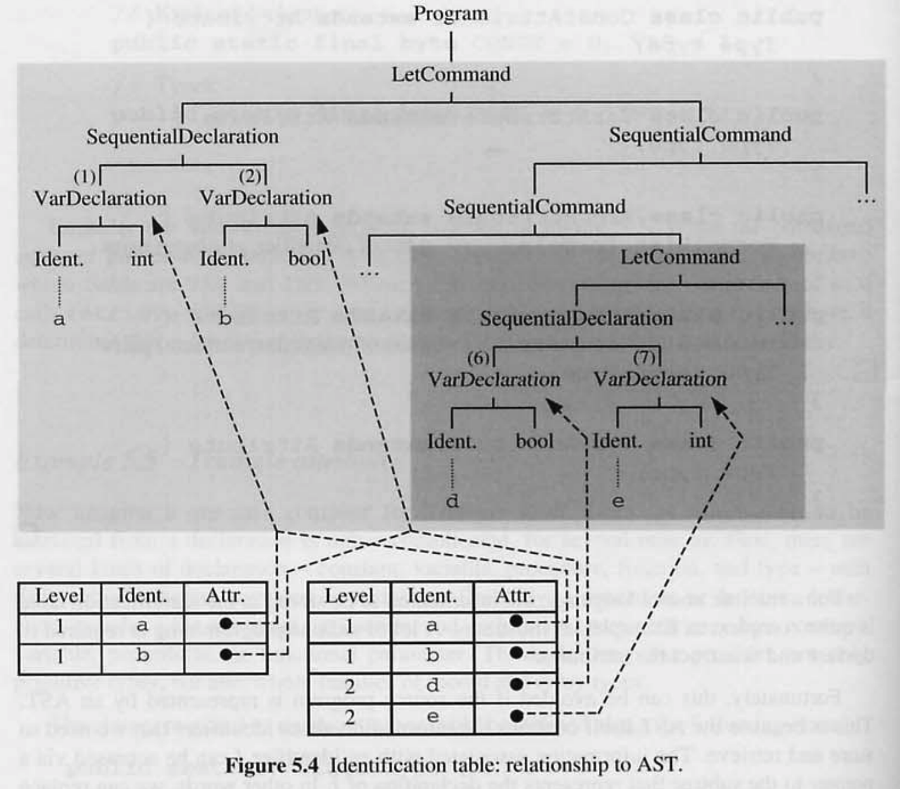

- 문맥 분석기가 서브트리 (1) 을 방문할 때, 식별자 a 와 서브트리 (1) 에 대한 포인터를 사용하여 `enter` 함수를 호출한다.
- 식별자 a 의 적용 발생을 방문할 때마다, 식별자 a 로 `retrieve` 함수를 호출하여 서브트리 (1) 에 대한 포인터를 검색한다.
- 이 서브트리를 검사하여 식별자 a 가 `integer variable` 을 나타내는 것으로 판단한다.

### 5.1.5 Standard environment

대부분 프로그래밍 언어들은 사전 정의 된 상수, 변수, 타입, 프로시저, 함수의 표준 컬렉션을 포함한다.

- 자바의 java.lang 패키지
- 하스켈의 표준 prelude
- Ada 의 Standard 패키지

이러한 컬렉션을 언어의 **Standard environment** 이라고 부른다.

따라서 식별이 시작될 때, 식별 테이블은 비어 있지 않지만, 표준 환경의 선언에 해당하는 항목이 이미 포함되어 있다.

이러한 식별자에 해당하는 속성을 구성해야 한다. 위의 예시 언어에서는, 소스 프로그램이 시작하기 전에 적절한 패키지의 텍스트를 처리함으로써 해결할 수 있다.

```java
import java.lang;
```

하지만 다른 경우에, 문맥 분석기는 해당 속성 값을 명시적으로 구성하고 식별 테이블에 입력하는 코드를 포함해야 한다.

프로그래밍 언어는 표준 환경에 적합한 범위 규칙도 지정해야 한다. 대부분의 프로그래밍 언어들은 **표준 환경을 전체 프로그램을 둘러싼 범위로 간주**하여 소스 프로그램이 범위 오류를 일으키지 않고 표준 환경에 존재하는 식별자의 선언을 포함할 수 있다. 이러한 경우 포준 환경의 선언은 식별 테이블에 _level 0_ 으로 입력되어야 한다.

C 언어 같은 일부 프로그래밍 언어는 소스 프로그램의 전역 선언과 동일한 수준에서 표준 환경을 도입한다.

**Example 5.7 Standard environment in Mini-Triangle**

Mini-triangle 의 표준 환경

```basic
type Boolean ~ ...;
const false ~ ...;
const true ~ ...;

func \ (b: Boolean) : Boolean ~ ...;

type Integer ~ ...;
const maxint ~ ...;

func + (i1: Integer, i2: Integer) : Integer ~ ...;
func - (i1: Integer, i2: Integer) : Integer ~ ...;
func * (i1: Integer, i2: Integer) : Integer ~ ...;
func / (i1: Integer, i2: Integer) : Integer ~ ...;

func < (i1: Integer, i2: Integer) : Boolean ~ ...;
func > (i1: Integer, i2: Integer) : Boolean ~ ...;

proc putint (i: Integer) ~ ...;

func = (val1: T, va12: T) : Boolean ~ ...;
```

- 단항 연산자 선언은 하나의 파라미터를 가지는 함수 선언처럼 취급.
- 이항 연산자 선언은 두개의 파라미터를 가지는 함수 선언처럼 취급.
- 연산자 심볼은 일반 식별자와 동일하게 처리된다. 문맥 분석기는 파라미터의 타입과 연산자의 결과에 대한 정보만 요구하므로 이러한 선언에 해당하는 표현식이 없다.
  - `E1 O E2` 표현식의 O 는 `T1 x T2 = T3` 타입의 이항 연산자이다. 타입 검사기가 E1 의 타입이 T1 과 같고, E2 의 타입이 T2 와 같다고 한다면, `E1 O E2` 의 타입이 T3 라고 추론한다. 그렇지 않으면 타입 오류가 발생한다.

일부 구문에서 타입 검사기는 유추된 타입이 예상된 타입과 동일한지 테스트하거나, 두 개의 유추된 타입이 서로 동일한지 테스트해야 한다. 일반적으로 if 표현식, while 표현식의 타입은 bool 타입과 동일해야 하고, 실제 파라미터의 타입은 해당 형식 파라미터의 유형과 동일해야 한다. 따라서 **타입 검사기는 주어진 두 개의 타입 T 와 T’ 가 동일한지 여부를 테스트할 수 있어야 한다.**

**Example 5.8 Mini-Triangle type checking**

Mini-Triangle 의 `Type` 클래스.

```java
public class Type {
	private byte kind;  // either BOOL or INT

	public static final byte BOOL = 0, INT = 1;

	public static Type (byte kind) {
		this.kind = kind;
	}

	public boolean equals(Object other) {
		Type otherType = (Type) other;
		return (this.kind == otherType.kind);
}
```

상수 또는 변수 식별자 _I_ 의 적용 발생의 타입을 추론하는 것은 간단하다. 만약 _I_ 가 상수 선언에서 선언되고, 그 오른쪽 식 유형이 _T_ 라고 추론된다면, _I_ 의 적용 발생의 타입은 _T_ 이다.

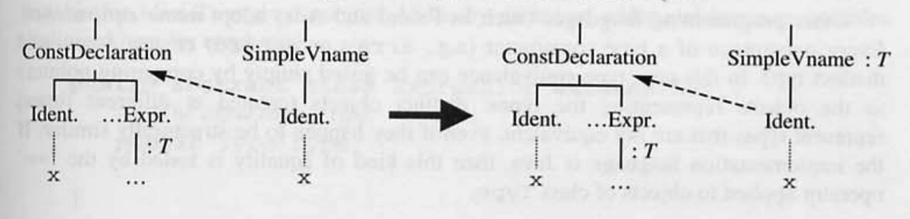

변수 선언도 동일하다.

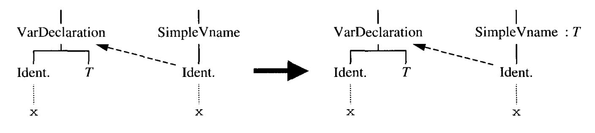

‘<’ 연산자의 타입은 `int x int → bool` 이다.

E1 의 타입이 int 와 동일한지, E2 의 타입이 int 와 동일한지 확인하면, 타입 검사기는 `E1 < E2` 의 타입이 bool 이라고 추론한다.

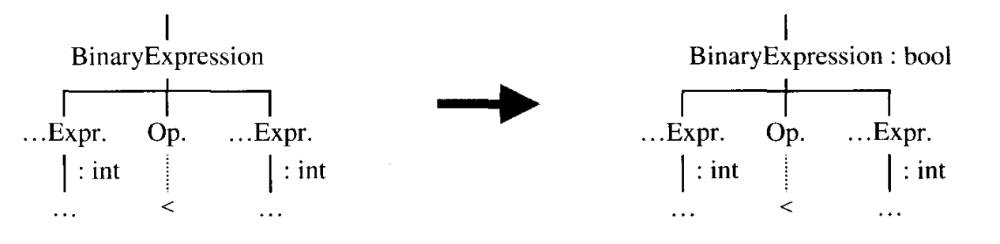

타입 동등성에 대해 두 가지 정의가 있다.

- **구조적 동등성 structural equivalence.**

  - 두 가지 타입은 구조가 같을 때만 동등하다.
  - 타입이 트리로 표현되는 경우, 트리 구조를 비교하여 구조적 동등성을 테스트 할 수 있다.
  - 자바의 경우 `equals` 메서드로 동등성을 테스트한다.
  - 예시 프로그램이다. 내부 구조가 동일해 `student` 와 `school` 을 동일한 타입으로 취급한다.

  ```pascal
  type student = record
  	name, address : string
  	age : integer

  type school = record
  	name, address : string
  	age : integer
  ```

- **이름 동등성 name equivalence.**
  - 타입 생성자가 발생할 때마다 새로운 고유 타입이 생성된다.
  - 이 경우 타입 동등성은 타입을 나타내는 객체와 포인터를 비교하는 것만으로 테스트 할 수 있다.
  - 다른 시간에 생성된 다른 객체는 구조적으로 유사하더라도 동등하지 않다.
  - 자바의 경우 ‘==’ 연산자로 동등성을 테스트한다.

## 5.3 A contextual analysis algorithm

각각의 식별자의 적용 발생은 `type checking` 을 수행하기 전에 식별되어야 한다.

원칙적으로 `Identification` 은 `type checking` 시작 전에 완료 할 수 있지만, 이점이 크지 않다.

일반적으로 `Identification` 과 `type checking` 는 소스 프로그램을 통해 단일 패스로 인터리빙 된다.

<aside>
💡 **인터리빙**(interleaving)의 사전적 의미는 '끼워 넣기'이다.

</aside>

만일 소스 프로그램이 AST 로 표현된다면, 단일 깊이 우선 순회(`Depth First Traversals`)에서 문맥 분석을 마칠 수 있다. 이 섹션에서는 섹션 4.4.1 에 기술된 AST 라고 가정한다.

### 5.3.1 Decoration

문맥 분석의 결과는 **장식된 AST** 에 기록될 수 있다.

- `identification` 결과는 각각의 식별자 _I_ 의 적용 발생으로부터 해당 I 의 선언까지 명시적인 링크를 만들어 기록할 수 있다. 이는 **장식된 AST 를 소스 프로그램의 자체 표현으로 만들 수 있는 장점**이 있다. (식별이 완료되면 식별 테이블을 제거.)
  - 컴파일러에서 이 링크를 각 식별자 노드의 포인터 필드로 나타낸다.
  - 다이어그램에서 이 링크를 점선 화살표로 표시한다.
- `type checking` 결과는 표현식 _E_ 의 루트 노드에 각 표현식 _E_ 의 추론된 유형 _T_ 를 저장하여 기록할 수 있다.
  - 컴파일러에서는 각 표현식 노드의 `Type` 필드로 표현한다.
  - 다이어그램에서는 표현식 노드의 오른쪽에 있는 주석 `: T` 으로 이 추론된 타입을 보여준다.

**Example 5.9 Representation of decorated ASTs**

장식된 AST 에 적합하도록 Mini-Triangle AST 클래스(예제 4.19) 수정.

```java
public abstract class Expression extends AST {
	// The expression's type.
	public Type type;
}

public abstract class Vname extends AST {
	// The value-or-variable-name's type,
	// and an indication of whether it is a variable or a value.
	public Type type;
	public boolean variable;
}

public class Identifier extends Terminal {
	// A pointer to the identifier's declaration (applied occurrences only).
	public Declaration decl;
}

public class Operator extends Terminal {
	// A pointer to the operator's declaration.
	public OperatorDeclaration decl;
}
```

### 5.3.2 Visitor classes and objects

문맥 분석기가 수행할 작업은 검사해야 하는 구문 클래스에 따라 달라진다.

Assignment command

```basic
V := E
```

1. V 의 타입을 확인하고 변수인지 확인.
2. E 의 타입을 확인
3. 두 타입이 동일한 타입인지 테스트.

block command

```basic
let
	D
in
	C
```

1. 내부 스코프를 연다.
2. D 를 체크한다.
3. C 를 체크한다.
4. 내부 스코프를 닫는다.

모든 경우, 특정 구문을 확인하는 것은 하위 구문을 확인하는 것을 포함한다.

따라서 소스 프로그램이 AST 로 표현되는 경우, **AST 순회가 체계적으로 구성되도록 설계**되어야 한다.

**Example 5.10 Mini-Triangle visitor methods**

문맥 분석기의 작업은 `Visitor` 의 메서드로 수행된다.

`visitA` 메서드를 통해 AST 의 하위 클래스 A 에 방문한다.

`visitor` 메서드들은 AST 를 원하는 순서로 순회하도록 협력한다.

```java
public interface Visitor {
	// prog : 방문해야 하는 하위 트리
	// arg : 추가 데이터
	public Object visitProgram(Program prog, Object arg);
	public Object visitAssignCommand(AssignCommand com, Object arg);
	public Object visitCallCommand(CallCommand com, Object arg);
	...
}
```

메서드에서 데이터를 전달할 수 있는 Object 타입의 반환값이 있다.

예시.

- `Visit…Expression` 의 반환 값은 Expression 타입.
- `Visit…Command` 의 반환 값은 null.

사실 문맥 분석기와 코드 생성기 둘 다 `Visitor` 객체로 구현될 수 있다.
AST 노드를 방문하는데 사용할 수 있는 `visit` 메서드를 통해 AST 클래스를 발전시킨다.

```java
public abstract class AST {
	...
	public abstract Object visit(Visitor v, Object arg);
}
```

하위 클래스에 구현한 visit 메서드.

```java
public class Assigncommand extends Command {
	...
	public Object visit (Visitor v, Object arg) {
		return v.visitAssignCommand(this, arg);
	}
}

public class Ifcommand extends Command {
	...
	public Object visit (Visitor v, Object arg) {
		return v.visitIfCommand(this, arg);
	}
}
```

공통된 형식.

```java
public class A extends ... {
	...
	public Object visit (Visitor v, Object arg) {
		return v.visitA(this, arg);
	}
}
```

### 5.3.3 Contextual analysis as a visitor object

문맥 분석기는 `identification` 과 `type checking` 을 수행하는 `Visitor` 객체이다.

문맥 분석기에서 `visitA` 메서드는 클래스 A 의 노드를 확인하여 노드에 의해 표현되는 구문의 타입이 잘못 됐다고 판단될 경우 에러 리포트를 생성한다.

문맥 분석기에서 `Visitor` 메서드는 편리한 **checking** 메서드라고 할 수 있다.

**Example 5.11 Mini-Triangle contextual analysis**

Mini-Triangle 의 Type.

```java
public class Type {
	private byte kind;  // either BOOL or INT

	public static final byte BOOL = 0, INT = 1;

	public static Type (byte kind) {
		this.kind = kind;
	}

	public boolean equals(Object other) {
		Type otherType = (Type) other;
		return (this.kind == otherType.kind
							|| this.kind == ERROR
							|| otherType.kind == ERROR);
	}

	public static Type bool = new Type(BOOL);
	public static Type int = new Type(INT);
	public static Type error = new Type(ERROR);
}
```

문맥 분석기의 visitor 메서드 개요.

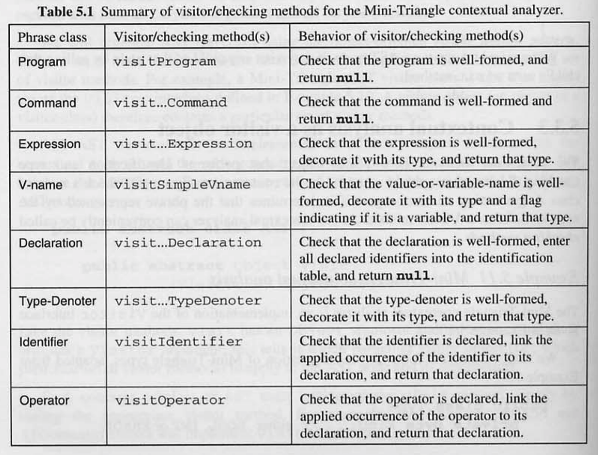

커맨드 구현.

```java
// V := E
public Object visitAssignCommand(AssignCommand com, Object arg) {
	Type vType = (Type) com.V.visit(this, null);
	Type eType = (Type) com.E.visit(this, null);
	if (!com.V.variable)
		... // Report an error - the left side is not a variable.
	if (!eType.equals(vType))
		... // Report an error - the left and right sides are not of equivalent type.
	return null;
}

public Object visitSequentialCommand(SequentialCommand com, Object arg) {
	com.C1.visit(this, null);
	com.C2.visit(this, null);
	return null;
}

// if E then C1 else C2
public Object visitIfCommand(IfCommand com, Object arg) {
	Type eType = (Type) com.E.visit(this, null);
	if (!eType.equals(Type.bool))
		... // Report an error - the expression is not boolean.
	com.C1.visit(this, null);
	com.C2.visit(this, null);
	return null;
}

// let D in C
public Object visitLetCommand(LetCommand com, Object arg) {
	idTable.openScope();
	com.D.visit(this, null);
	com.C.visit(this, null);
	idTable.closeScope();
	return null;
}
```

표현식 구현.

```java
public Object visitIntegerExpression(IntegerExpression expr, Object arg) {
	expr.type = Type.int;  // decoration
	return expr.type;
}

public Object visitVnameExpression(VnameExpression expr, Object arg) {
	Type vType = (TypeDenoter) expr.V.visit(this, null);
	expr.type = vType;
	return expr.type;
}

// E1 O E2
public Object visitBinaryExpression(BinaryExpression expr, Object arg) {
	Type e1Type = (Type) expr.E1.visit(this, null);
	Type e2Type = (Type) expr.E2.visit(this, null);

	OperatorDeclaration opdecl = (OperatorDeclaration) expr.O.visit(this, null);
	if (opdecl == null) {
		... // Report an error - no such operator.
		expr.type = Type.error;  // decoration
	} else if (opdecl instanceof BinaryOperatorDeclaration) {
		BinaryOperatorDeclaration bopdecl = (BinaryOperatorDeclaration) opdecl;

		if (!e1Type.equals(bopdecl.operand1Type))
			... // Report an error - the left subexpression has the wrong type.
		if (!e2Type.equals(bopdecl.operand2Type))
			... // Report an error - the right subexpression has the wrong type.
		expr.type = bopdecl.resultType;  // decoration
	} else {
		... // Report an error - the operator is not a binary operator.
		expr.type = Type.error;  // decoration.
	}
	return expr.type;
}
```

Vname 구현.

```java
public Object visitSimpleVname(Simplevname vname, Object arg) {
	Declaration decl = (Declaration) vname.I.visit (this, null);
	if (decl == null) {
		...  // Report an error - this identifier is not declared.
		vname.type = Type.error;
		vname-variable = true;  // decoration
	) else if (decl instanceof ConstDeclaration) {
		vname.type = ((ConstDeclaration) decl).E.type;
		vname.variable = false;  // decoration
	} else if (decl instanceof VarDeclaration) {
		vname.type = ((VarDeclaration) decl).T.type;
		vname.variable = true;  // decoration
	}
	return vname.type;
}
```

선언 구현.

```java
public Object visitConstDeclaration(ConstDeclaration decl, Object arg) {
	decl.E.visit(this, null);  // result is ignored
	idTable.enter(decl.I.spelling, decl);
	return null;
}

public Object visitVarDeclaration(VarDeclaration decl, Object arg) {
	decl.T.visit (this, null) ;  // result is ignored
	idTable.enter(decl.I.spelling, decl);
	return null;
}

public Object visitSequentialDeclaration(SequentialDeclaration decl, Object arg) {
	decl.D1.visit(this, null);
	decl.D2.visit(this, null);
	return null;
}
```

식별자 구현.

```java
public Object visitIdentifier(Identifier id, Object arg) {
	id.decl = idTable.retrieve(id.spelling);  // decoration, possibly null.
	return id.decl;
}
```

문맥 분석기 구현.

```java
public final class Checker implements Visitor {
	private IdentificationTable idTable;

	... // visitor/checking methods, as above.

	public void check(Program prog) {
		idTable = new IdentificationTabe();
		idTable.enter("false", ...);
		idTable.enter("true", ...);
		...
		idTable.enter("putint", ...);
		prog.visit(this, null);
	}
```

문맥 분석기를 Visitor 객체로 만드는 것은 큰 이점을 가진다.

- `Checker` 라는 단일 클래스 내에 문맥 분석기 코드를 통합. 문맥 분석기를 학습하고 변경하는데 용이함.
- AST 순회의 완료를 보장한다. 문맥 분석기가 AST 의 모든 노드 클래스를 방문하기 위한 코드를 포함한다.
  일부 노드 클래스에 대한 코드의 누락을 방지할 수 있음.
- 이후에, 동일한 구조로 코드 생성기와 AST 를 순회해야 하는 다른 프로세스에도 적용할 수 있다.

## 5.4 Case study: contextual analysis in the Triangle compiler

### 5.4.1 Identification

Triangle 은 중첩된 블록 구조이므로, 식별은 다단계 식별 테이블(섹션 5.1.3)을 사용하여 수행된다.

식별 테이블은 단순하게 범위 레벨, 식별자, 선언을 포함하는 엔트리 스택으로 표현한다.

- `enter` 메서드는 새 엔트리를 테이블에 추가한다.
- `retrieve` 메서드는 스택을 위에서 아래로 검색한다.
- `openScope` 는 범위 레벨을 증가시킨다.
- `closeScope` 는 현재 레벨의 엔트리를 제거하고, 범위 레벨을 감소시킨다.

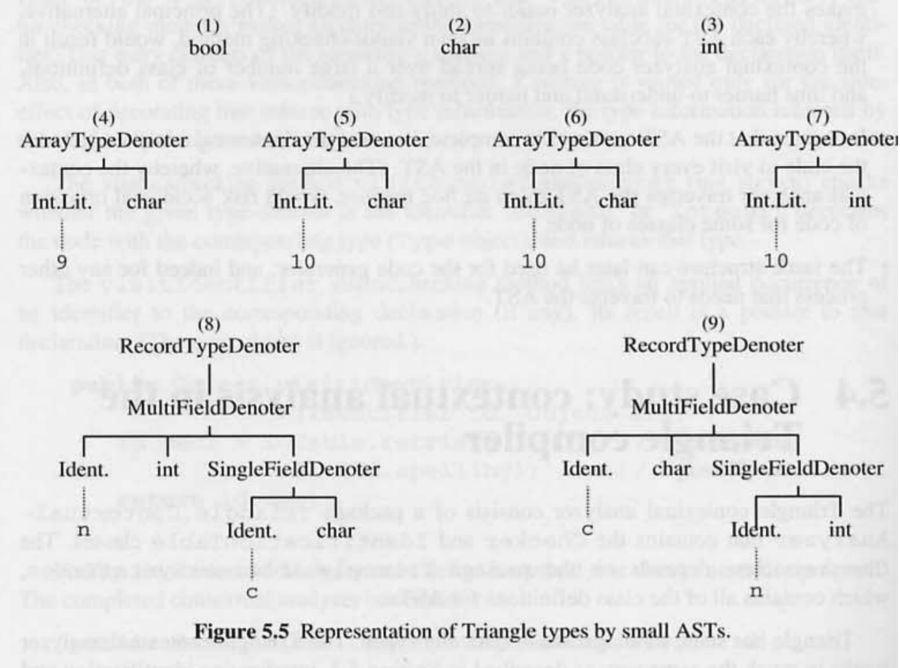

Exercise 5.4, 5.5 에 더 나은 구현 방법을 제안한다.

### 5.4.2 Type checking

그림 5.5 의 타입을 표현. 배열 과 레코드 타입이 포함된다.

```java
(1) Boolean
(2) Char
(3) Integer
(4) array 9 of Char
(5) array 10 of Char
(6) array 10 of Char
(7) array 10 of Integer
(8) record n: Integer, c: Char end
(9) record c: Char, n: Integer end
```

섹션 5.3 에 사용된 `Type` 클래스가 아닌 `TypeDenoter` 클래스를 사용한다.

```java
public abstract class TypeDenoter extends AST {
	public abstract boolean equals(Object other);
	...
}
```

Triangle 의 타입 동등성은 구조적 동등성이기 때문에 (5) 와 (6) 은 동일한 타입이다.

타입 식별자는 타입 동등성 테스트를 복잡하게 하므로, 복잡성 제거를 위해 타입 디노터에 대한 visitor 메서드가 모든 타입 식별자를 제거하도록 하였다. 각 타입 식별자를 그것이 나타내는 타입으로 대체할 수 있다.

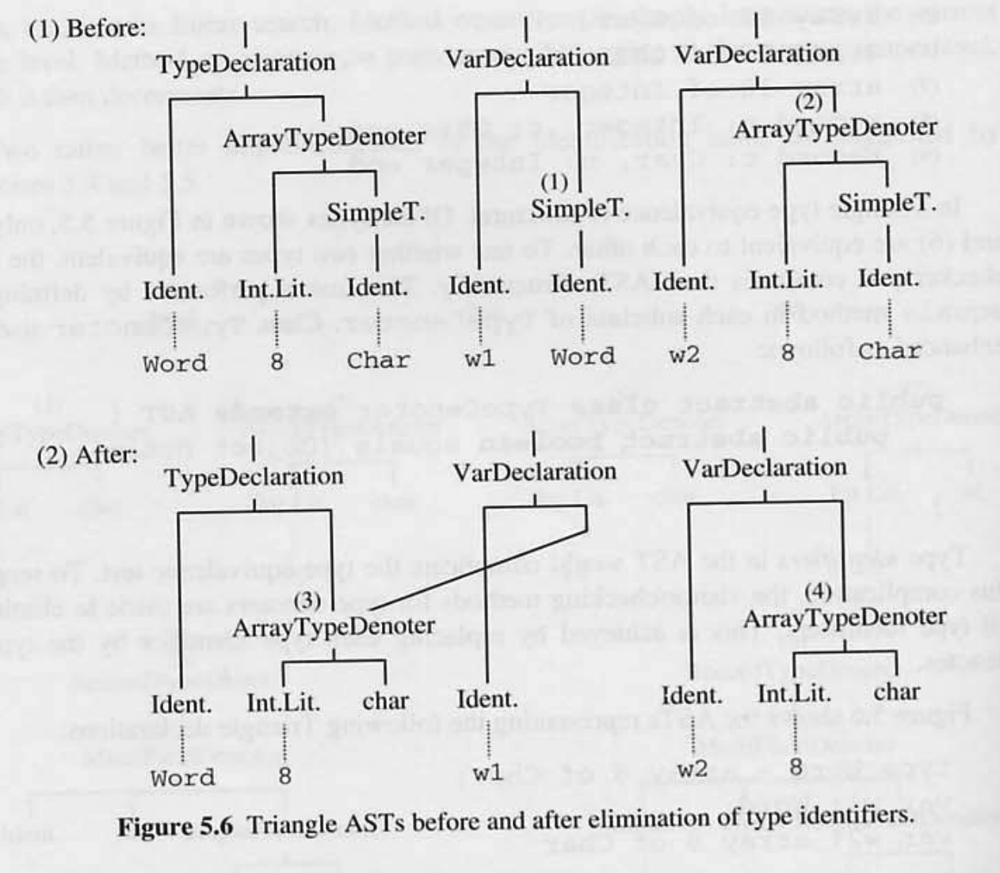

그림 5.6 의 소스 프로그램

```java
type Word ~ array 8 of Char;
var w1: Word;
var w2: array 8 of Char
```

### 5.4.3 Standard environment

표준 환경의 AST

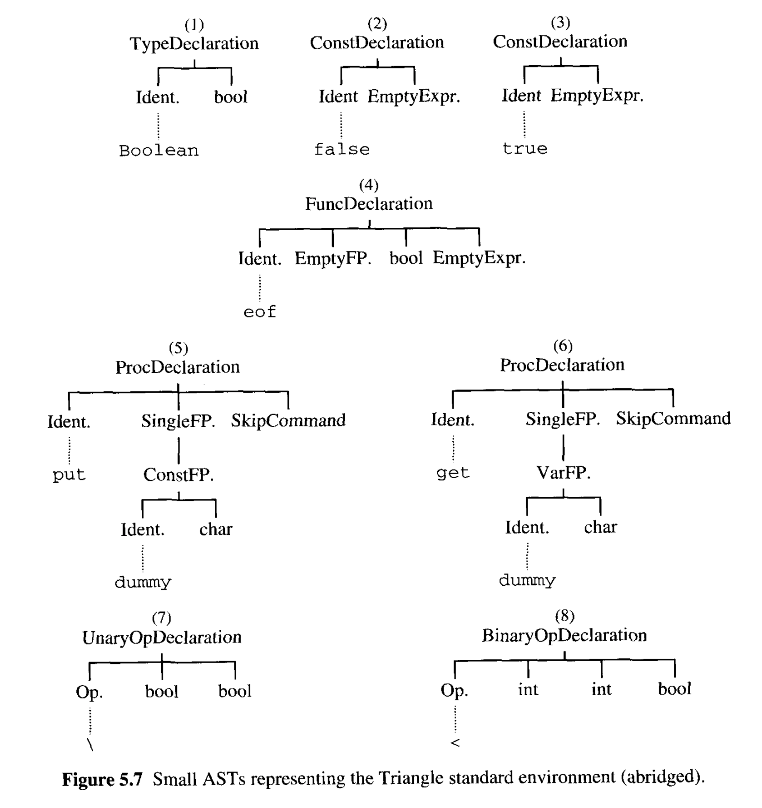

표준 환경의 선언.

```java
// type declaration
(1) type Boolean ~ ...;

// constant declaration
(2) const false ~ ...;
(3) const true ~ ...;

// function declaration
(4) func eof() : Boolean ...;

// procedure declaration
(5) proc get (var c: Char) ...;
(6) proc put (c: Char) ~ ...;

// operator declaration
(7) func \ (b: Boolean) : Boolean ~ ...;
(8) func < (i1: Integer, i2: Integer) : Boolean ~ ...;
```

표준 환경이 포함된 식별 테이블.

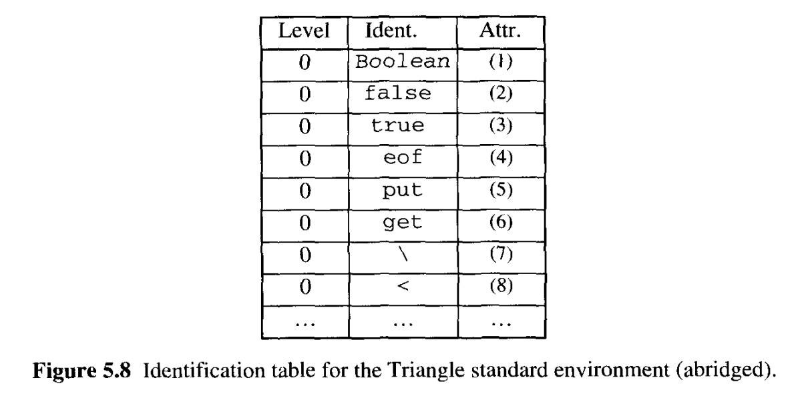
