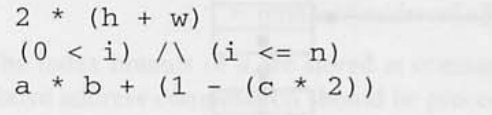
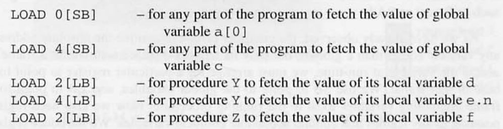

# Run-Time Organization

프로그램 언어는 타입, 변수, 표현, 과정, 함수, 파라미터등 high-level 개념을 제공한다. 타겟 머신은 일반적으로 bits, bytes,words, registers, stacks, address, routine 등의 낮은 level 의 개념을 제공한다. 

high<> lower level 의 차이를 sematic gap 이라고 부른다. 이 간극을 채우는 것이 code generator 이다.

code generator 를 쓰기 전에, 타겟 머신의 리소스( 저장, 시스템 소프트웨어) 소스 언어를 구현해야 한다. 이것을 run-time-organization 이라고 한다. 이것이 이번 장의 주제이다. 

### 런타임의 구성의 주요 key
* Data representation
    * source-language type 을 타겟 머신에 나타내기 위함 
*  Expression evaluation
    * 수식 계산 구성하고, 중간 결과를 관리하기 위함
* Storage allocation
    * 변수에 대한 저장소 구성
    * global, local, heap 변수에 관한 lifetime 고려 해야 함 
*  Routines
    * 절차, 함수 매개 변수를 어떻게 구현해야 한다.  

low-level 과정에 관련하여 합리적인 프로그래밍 결정을 내리기 위해서 프로그래머는 high-level 언어 구성의 효율성을 가져야 한다. ex(데이터 구조, 두고 보면 알겠지만 static array 를 저장) 그러나 동적 배열과 재귀 type 은 오버헤를 나타낸다. (주소 지정, GC)이번 챕터에서는 이러한 모든 주제를 다룬다.

## 6.1 Data representation

* high-level

    프로그래밍 언어는  boolean, integers, char, record, array 같은 high-level data type 을 제공한다.

* low-level

    타겟 머신은 bits, bytes, words, double-words 같은 type 을 낮은 수준의 산술 연산과 논리 연산과 함께 제공한다. 
    
source langauge 와 target machine 의 의미적 차이를 줄이기 위해 다음을 결정해야 한다. 

* data 표현 원리
    * Nonconfusion : 주어진 type 의 다른 value는 다르게 표현해야 한다.
    * Uniqueness : 각 value 는 같은 표현식을 가져야 한다.

* Nonconfusion
    *  만약 두개의 다른 값이 같은 표현식을 가지면 이 값은 동등하게 잘못 취급한다.
    *  컴파일에 type check로 다른 값인지 확인한다.  
    * 00 ... 002 가 논리 연산자의 연산자라면 false 를 나타내고, 산술 연산의 연산자면 0 을 나타낸다.
* Uniqueness
    - 필요조건은 증명할 필요가 없다.
    - 값 비교는 하나 이상의 표현을 가질 가능성이 있고 복잡하다.
    - 올바른 비교는 가능하지만, 필수적인것 보다 Uniqueness 한게 바람직하다.
    - ex) nonuniqueness 의 예시 -> 정수의 1보완 방법 
    - 0은 00.. .002(+0)과 1 1.. .112(-0!) 로 나타낼 수 있다. 
    - bit-string 비교는 이 값을 같지 않다고 잘못 비교 할 수 있다. 
    - 그래서 정수 비교를 사용해야 한다. 대안으로 2의 보수 표현은 정수의 고유한 표현을 제공한다.

데이터 표현에서는 실용적인 문제를 염두해 두어야 한다. 

### Constant-size representation
- 모든 값의 표현은 같은 양의 공간을 차지 해야 한다.
- 컴파일러가 저장 공간 할당을 계획 할 수 있게 한다.
- 실제 값이 아닌 변수의 값을 알아야 컴파일러는 해당 변수가 얼만큼 저장 공간을 차지 할 지 알 수 있다.

### 직접 참조, 간접 참조 
특정 값이 포인터를 통해 직접 접근 간접 접근이 가능 여부
* 직접 참조 
    
      
    * x 값에 대한 직접 참조는 x 자체에대한 이진법을 나타낸다. 
* 간접 참조 
    * x 값에 대한 간접 참조은 x 의 이진법 표현을 포함하는 저장 영역(heap) 을 가리키는 handle 이다. 
          
          
    - 위 구분을 이해하려면 x 값이 복사될때 어떤 일이 일어나는지 시각화하면 도움이 된다. ex(  arguemnt 전달)
    - 직접 접근 - x 가 직접적으로 주소에 접근 할 수 있음
    - 간접 접근 - x 에 access 해야 하기 때문에 그렇게 불리운다.
    
    * 직접 참조와 간접 참조의 선택이 Rung-time 구성의 중요한 설계 결정이다. 
        - pascal, C - 직접 주소 지정을 통해 값에 효율적으로 접근 할 수 있고, 힙 저장소 관리 오버헤드를 피할 수 있기 때문에 가능한 직접 참조를 택한다.
        - ML haskell - 다형성 함수의 구현을 단순화 하기 위해 간접 표현을 택한다.
        - Java 와 같은 객체 지향 언어 구현은 primitive type 은 직접 참조를 적용하고, 객체에 대하여는 간접 참조를 택한다.

    * 간접 참조는 값의 크게 달라지는 type 에는 필수적이다. 예를 들어 list, 동적 배열은 요소의 수에 제한이 없을 수 있고, 전체 공간의 sacpe 는 요소의 따라 다르다. 이와 같은 경우 간접 참조는 constants-size (고정 크기) 요구 사항을 만족시키는 방법이다. 

    * 예를 들어 x 와 y 는 서로 다른 공간을 차지하지만 x와 y 에 대한 핸들은 같은 공간을 차지한다. 
    가능한 직접 참조 방식을 가정할것이다. ex) primitive type, record, static array 
    그러나 동적 배열이나 재귀 type 에는 간접 참조 방식이 필요하다는 것을 알게 될 것이다.

    - #T 는 type의 관계 수를 나타낸다. 즉 type T 의 고유 값 수를 나타낸다.
        * ex) #[Boolean] = 2.

    - size T 는 차지한 공간(bit, byte, word)를 나타낸다. 간접 표현이 필요한 경우는 핸들만 계산된다.
        - #[Boolean], size[Boolean]
        - `[[Boolean]]`or `size[[Boolean]]`
        - 강조 괄호를 사용하여 특정 유형 표시자를 묶는다. `size[[array 8 of Char]]`
        - cardinarity → 경우의 수를 의미


### 6.1.1. Primitive types
- primitive type 이란 프로그래밍 언어의 원시적인 값이다. 더 이상 분해될 수 없는 값이다.
- ex ) Boolean,Char, Integer
- 기계는 일반적으로 primitive type 과 연산을 직접적으로 지원하기 때문에 간단하게 표현 될 수 있다.
- Booolean 유형의 값은 true, false 이다.
- true 는 한단어로 표현 할 수 있다. one byte 혹은 single bit 로
    - word - 32 bit

### Boolean 

     `#[[Boolean]] = 2(경우의수)`  `size [[Boolean]] >= 1bit` 이다. 

- single bit  사용하는 경우 0 은 false 1 은 true 이다.
- byte 혹은 word 를 사용하면 거짓은 00..002 가 false고 00..012 혹은 11..112 은 true 다.
- boolean 값에 대한 연산은 NOT, AND, OR 로 구현할 수 있다.

    
### Char 

- 문자 집합의 요소이다.
- 때때로 source 언어가 특정 문자 집합을 지정한다.
    - ex ) Ada 는 2^8  개의 문자로 구성된 `ISOLatin1`  문자 집합
    - ex ) Java 2^16 개의 고유한 문자로 구성된 유니코드 문자 집합

- 대부분의 프로그래밍 언어는 문자 집합에 대해 구체적이지 않다. 

컴파일러 작성자는 대상 시스템의 ‘native’ 문자 집합을 선택 할 수 있다. 
일반적으로 2^7 또는 2^8 개의 문자로 구성되어 있다. 
문자 집합 선택에 따라 개별 문자의 표현이 결정된다. ex) ISO 는 ‘A’ 를 `01000001(2)` 로 정의한다. 우리는 char 를 1 byte 1 word 로 나타낼 수 있다.


### Interger
- 정수
- 고정된 공간안에서 무한한 범위의 정수를 나타낼 수 없다.
- Integer 는 정의한 정수 범위를 나타낸다.
- integer의 이진표기는 target machine 의 산술 단위에 의해 결정된다.  대부분 one word 이상 차지한다.
- 소스 언어의 정수 연산은 대부분 기계 연산에 의해 구현 될 수 있다.

    ex) Pascal & Triangle 에서 Interger 범위는  

    `-muxint, ..., -1, 0, +1, ..., +maxint,` 이렇게 나타내며 여기서 상수 maxint 는 구현에서 정의된다. 

    `#[[Integer]] = 2 x maxint + 1` 이런식으로 표기할 수 있다.
        

    java 에서 int 범위는 -2^3l, ..., -1,0, +1, ..., +2^31 -1 로 정의한다. 
    → #[[Integer]]=2^32  

### 6.1 Primitive data represntations in TAM 
- TAM 은 Triangle 컴파일러의 target 머신이다.
- 저장소는 16-bit words 로 구성되어 있다.
- 더 작은 저장 장치는 없지만, 여러 단어로된 객체의 주소를 지정할 수 있다.
- primitive type 유형 
      
* maxint  = 2^15-1 = 32767 

### 6.2 Primitive data representations in the Intel Pentium
* 저장소는 8-bit bytes, 16-bit-half-word, 32-bit-words, 64-double-word 구성 
  
* maxint = 2^15-1 (half)  maxint = 2^31-1 (32-bit) 

### Enumeration type
- 어떤 프로그래밍 언어는 primitive type 을 프로그래머가 정의 할 수 있도로 함
- 그 예시가 pascal 의 enumeration type 이다. → 열거형
- 열거형은 작은 정수 값으로 나타낼 수 있다.

### 6.3 Enumerand representation
```
type Color = (red, orange, yellow, green, blue)
```
- 5가지의 열거형을 생성
- red, oragne 같은 식별자를 열거형에 바인딩
```
red - 00.. .000(2)
oragne 00.. .001(2)
yellow 00.. .010(2)
green 00.. .011(2)
blue 00.. .100(2)
```
- `#[[C]olor]=5` 때문에, size[Color] ≥3 bit 보다 크다.
- 일반화하려면 다음과 같이 정의를 고려해야 한다.
      
`#T = n` , `size T ≥log2n bits`

- 열거형의 연산
    - succ - 열거형의 다음 값을 알 수 있다. 
    - ord - 열거형의 정수 표현

### 6.1.2 Records
- composite type(복합 type) 은 값이 단순한 값으로 구성되어있다.
- 각각의 identifier(식별자)가 여러 Field 로 구성된다.
- 기본 작업은 필드 선택, 이에 따라 field 식별자를 사용하여 필드에 접근한다.
- pascal, Ada, Triangle , C 에서는 구조체로 발생한다.


### 6.4 Triangle record representation
  
- primitive 값이 one word 차지한다고 가정한다.
- variable today, her (초기화 후) 다음과 같다.
  
- 알 수 있는 것
    - Record 변수의 전체 크기, 레코드 기준에 대한 필드의 위치

- 만일 today 주소 100 에 있다면, 102 까지 today 이라는 것을 알 수 있다.
    - y - 100, m -101, d -102 각각 offeset(상대주소)  이 0,1,2 이다.
    - female, dob, status 는 0,1,4 의 offeset 을 가진다.
      
    - 컴파일러가 레코드의 주소를 알고 있으면 모든 필드의 주소를 결정 할 수 있다.
    - 필드에 직접 엑세스 하는 코드 또한 생성 가능하다.
        - 위 상황에서 필드 선택은 비용이 들지 않는다.
    - 그러나 어떤 기계에서는 정렬 제한이 있어서 레코드 필드 사이에 사용되지 않는 공간이 남게 될 수 있다.
    
    ### 6.1.3 Disjoint unions (분리합 집합)
    
    - tag , variant part 로 구성된다.
        - tag 값에 따라 variant part 유형이 결정된다.
    - 수학적으로 우리는 Disjoint unions 를 다음과 같이 설명한다.
        - `T = TI + ... + T,`
    - T 유형의 값에서 variant part  는 `TI + ... + T,` 중에서 선택된 값이다. tag 는 이 중 어느 것을 나타낸다. (둘이 뭐가 다르지?)
    - 기본 연산
        - a- tag 테스팅
        - b - 각 구성 요소 Ti 에 대한 일반 값을 제공하기 위한 varaiant part 제공
    - variant recrod 에서 tag 는 단지 field 이다. variant 구별되어있는 field 들이다.
    - projection 은 일반적인 field 선택과 유사하다.
    - Disjoint unions (분리합 집합)  의 적절한 표현은 tag 와 variant part 의 병렬배치이다.
        - 그러나 variant part 에는 여러 유형이 있을 수 있음으로 복잡하다. 
        크기도 여러개일 수 있어서  우리는 constant-size 요구사항을 주의해아한다.

### Example 6.5 Pascal variant record representation
  
- Number type 값에는 acc 라는 tag field 와 variant part 를 가지고 잇다.
- tag 값은 variant part 를 결정 짓는다.
- tag (true) → variant part 는 i 이고 tag (false) → variant part 는 r 이다.
- boolean 또는 integer  1 word 를 차지한다고 가정하면 변수 num 은 아래와 같다.
  
- 어떤 경우는 2word 차지하고 , 어떤 경우는 3 word 하니까 constant-size 요구사항과 대조된다.
- 이러한 비용을 피하기 위해 three word 로 할당한다.
    - one word - tag field
    - two word - variant part
      
- empty variant & 둘 이상의 variant 가 있는 경우 
  
- s 라는 tag 가 있음
    - tag == point → variant part 비어있고
    - tag == circle → variant 정수 Field
    - tag == box → variant 정수 Intenger
      
      


### 6.1.4 Staic arrays 
- 같은 type 의 여러 요소로 구성되어 있다.
- 제한된 범위의 index 를 가지고 있다. (보통 정수)
- 정적 배열
    - index 범위는 컴파일 시점에 안다.
    - index 증가는 runt-time 주소에 구현된다.

### Example 6.6 Triangle array representation
  
  
  
  

### 6.1.5 Dynamic arrays
- index  범위가 런타임까지 알 수 없는 배열
- Algol and Ada 에서 발견
- constant-size 요구사항을 충족 시키기 간접 참조 방식을 채택함.
    - 동적 배열의 handle 은  배열의 요소의 pointer 뿐만 아니라, index 범위도 포함해야 한다.

### Ada dynamic array representation
  
  
- 각 배열의 handle 에는 배열의 원점 element 의 주소가 포함된다.
    - index 0 으로 handle 에는 배열의 lower bound, uper bound 도 같이 포함되어있다.
- 변수 k = 7 , m=0, n =4 가 있다고 가정했을때 배열 d는 index 1~7 경계를 가지고, 배열 s 의 index 범위 0~ 3 까지이다.
- 각 배열 핸들은 3개의 word 를 저장한다.
    - 정수 및 주소가 1 word 를 차지한다.
- 일반화 적용 모습 
  

### 6.1.6 재귀 type
- 그 자체로 정의된 유형
- type T 가 T의 구성 요소를 갖는다.
- pascal 의 재귀 type 은 포인터에 의해 정의 된다.
- record 는 같은 type 의 record 를 포함할 수 없지만, 동일한 type 의 pointer 는 포함 할 수 있다.


### 6.9 Pascal linked list represenstation 
  
  
- ntList 는 IntNode 에 대한 포인트이고 Integer 와 IntList 에 대한 포인터가 포함되어 있다.
- 포인터가 차지 하는 저장 크기
  

## 6.2 Expression evaluation 
* high-level 프로그래밍 언어의 첫번째 특성으로 대수 표현식을 작성 할 수 있다. 
  
- 중간 결과를 어디에다간 저장하는게 필요하다.
- 많은 기계는 중간결과를 저장 할 수 있는 register 를 제공한다.
    - 일반적으로 r0, r1, r2 로 명칭한다.

### 6.10 Expression evaluation in a register machine 
```
( a * b ) + (1 - (c * 2)) 
```
  
```
[[a]] = 100 
```
  
* 중간 결과를 유지하기 위한 스택을 제공한다. 

### 6.11 Expression evaluation in a stack machine 
  
  


## 6.3 Staic storage allocation 
- 변수에 저장을 할당하는 것 - 글로벌 변수만 고려
- 6.4 에서 지역변수를 고려한다.
- 소스 프로그램의 각 변수에는 값을 할당 할 수있도록 충분한 저장 공간이 필요하다.
- 소스 언어가 정적으로 type 이면 컴파일러는 변수 type 을 알 수 있다.
    - 따라서 constant-size 의 결과로 컴파일러는 변수 T에 얼마나 많은 저장소가 할당 되어야 하는지 알 수 있다.
- 글로별 변수 저장
    - 가장 간단하다.
    - 런타임 동안 존재한다.
    - 컴파일러는 고정 위치에서 해당 변수를 쉽게 찾을 수 있다.
    - 정확한 주소를 결정 할 수 있다.  → 이를 정적 저장소 할당이라 한다.

### 6.13 Static storage allocation 
  
  
  

## 6.4 Stack storage allocation 
- 지역 변수
    - procesdure 함수 안에 선언되는것을 뜻함
    - 함수가 실행되는 동안 존재
    - 만일 어떤 과정이 여러번 실행되면, v 여러번 lifetime 을 갖는다.

### 6.14  Stack storage allocation 
  
- a,b,c - 글로벌 변수
- d,e - 로컬 변수 ( Y 함수의)
- f - 로컬 변수 (Z 함수의)
  
- 글로벌 변수는 프로그램 실행 동안 한번 존재한다.
    - static 할당
- 지역 변수의 lifeTime 은 집합(nested) 적이다.
    - 로컬 변수가 생성되면 머지 않아 제거 된다.
    - stack 사용
    - stack storage allocation

### 6.4.1 Accessing local and global variable
* stack frames 수를 포함한다. 

### 6.15 stack frames 
  
  

처음에 프로그램이 실행 될때 글로벌 변수만 스토리지 Snapshot 1 에 점유 하고 있다. Y procedure 를 호출하면 Y 의 로컬변수를 위한 공간이 있는 스택이 Snapshot2 로 푸시된다. … 

- 물론 스택의 크기도 다양한다. 스택 내의 특정 프레임의 위치를 미리 에측 할 수는 없다.
- 글로벌 변수와 현재 실행 중인 procedure 의 로컬 변수에만 엑세스 할 수 있다.
- **link data** - 로컬 변수의 공간뿐만 아니라 프레임에는 전체적으로 **링크 데이터**로 알려진 특정 하우스 키핑 정보가 포함되어 있다.
- **return address** - procedure 실행이 끝난 후 return 주소를 알 수 있다.
- **dinamic link -** 스택 기본 프레임 베이스에 대한 포인터
  

### 6.16  Accessing global and local variable 
  
  
- 컴파일러는 지역 변수의 절대 주소를 결정 할 수 없다. 그러나 프레임이 주소 변위를 결정 할 수 있다.
- 스택 할당은 storage 이용에 경제적이다.
- 정적 할당의 경우 프로그램 실행 시간 동안 저장 공간을 차지하겠지만, 스택 할당을 이용하면 특정 시간에만 차지 한다.

### 6.4.2 Accessing nonlocal variables
- nonlocal variable 에 직접 접근 할 수 있다.
- L1, L2 소개

### 6.17 Accessing nonlocal variables
- Procedure P -  글로벌 변수 접근 가능  지역 변수 가지고 있음
- Procedure Q -  글로벌 변수 접근 가능, 지역 변수 가짐, P & Q 에서 소멸
- R - 글로벌 변수 접근 가능, 지역 변수 가짐, P & Q 에서 소멸
- S - 글로벌 변수 접근 가능, 지역 변수 가짐, P 에서 소멸
  
  
- LOAD d [ SB] - Q 의 글로벌 변수 가져오기
- LOAD d [ LB] - Q 의 로컬 변수 값을 가져오기 위함
- LOAD d [ L1] - Q 의 가변 로컬 값을 P 로 가져오는것
- LOAD d [ L2] - Q 의 가변 로컬 값을 P 로 가져오는것
  
  