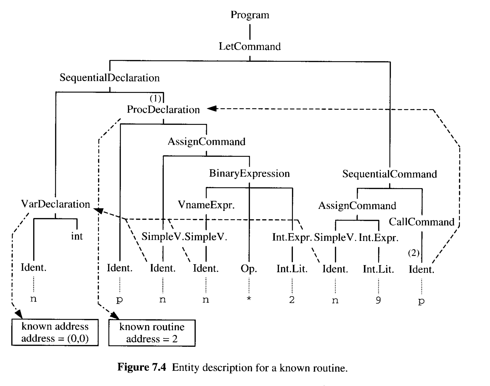

# Code Generation

| 단계              | 목적                                  | 의존                            |
| ----------------- | ------------------------------------- | ------------------------------- |
| 구문분석/문백분석 | 소스 프로그램의 분석                  | 소스 언어                       |
| 코드 생성         | 번역(소스 프로그램 -> 목적 코드 번역) | 소스 언어, 목적 언어, 타겟 머신 |

타겟 머신의 영향으로 인해 코드 생성의 일반적인 원리를 설명하는 것이 구문분석/문맥분석에 대해 설명하는 것보다 더 어렵다.  
주된 문제는 타겟 머신의 다양성이다. 코드 생성기의 구조는 타겟 머신의 구조에 큰 영향을 받게 된다. 한 타겟 머신에서 적합한 코드 생성 알고리즘이 다른 타겟 머신에 적용하기가 어렵거나 불가능할 수 있다.

코드 생성의 주된 문제들은 다음과 같다.

- **Code selection.** 소스 프로그램에서 각 구문의 목적 코드가 되는 타겟 머신의 명령 시퀀스를 결정하는 문제.  
  이 문제를 해결하기 위해 _code templates_ 을 사용한다. _code template_ 은 특정 형태의 모든 구문의 목적 코드를 지정하는 규칙이다.

- **Storage allocation.** 소스 프로그램에서 각 변수의 주소를 결정하는 문제.  
  코드 생성기는 전역 변수의 주소를 정확히 결정(_static storage allocation_) 할 수 있지만, 지역 변수의 주소는 오직 상대적으로 결정(_stack storage allocation_) 할 수 있다.

- **Register allocation.** 타겟 머신이 레지스터를 가지고 있다면, 레지스터는 표현식 평가 중에 중간 결과를 기록하는데 사용되어야 한다.  
  특정 레지스터에 변수 _v_ 의 현재 값이 포함되어 있다는 것을 알고 있는 코드 생성기는 _v_ 값이 필요할 때 메모리 사이클을 저장하기 위해 이를 활용해야 한다.  
  복잡한 식을 평가할 수 있는 레지스터가 없을 수도 있고, 일부 레지스터는 특정 목적을 위해 예약될 수도 있다.

레지스터 머신을 위한 코드 생성기보다 스택 머신을 위한 코드 생성기가 더 쉽다. 스택은 표현식 평가에 편리해서, **register allocation** 의 문제가 간단히 해결된다. 이 책에서는 스택 머신을 위한 코드 생성기만 고려하기에, **code selection**, **storage allocation** 문제를 다룬다.  
또한 TAM 추상 머신을 타겟 머신으로 사용한다.

## 7.1 Code selection

코드 생성기의 기능은 소스 프로그램을 의미적으로 동일한 목적 프로그램으로 변환하는 것이다.  
일반적으로 프로그램이나 구문의 정확환 번역이 많다. 소스 언어 명령을 올바르게 수행하는 여러 개의 명령 시퀀스가 있을 수 있다. 따라서 코드 생성기의 작업은 **각 경우에 어떤 명령 시퀀스를 생성할지 결정**하는 것이다. 이를 **code selection** 이라고 한다.

### Code templates

#### Example 7.1 Code functions and code templates

**Code functions**  
각 커맨드 C 를 타겟 머신 명령 시퀀스로 변환하는 함수는 아래와 같다.

```
execute : Command -> Instruction
```

이러한 함수를 소스 언어의 모든 커맨드에 대해 정의해야 한다. 이는 _code template_ 을 사용하여 수행된다.

커맨드 2개를 연속적으로 실행하는 시퀀셜 커맨드는 다음과 같이 정의할 수 있다.

```
execute [[ C1 ; C2 ]] =
    execute C1
    execute C2
```

많은 코드 템플릿은 특정 명령을 가진다. 할당 커맨드 'I := E' 의 경우 다음과 같다.

```basic
execute [[ I := E ]] =
    evaluate E
    STORE a  // a : variable 식별자 I 의 주소
```

두 개의 할당 커맨드를 가진 시퀀셜 커맨드는 다음과 같다.


Code template 정리

- 각 소스 언어 구문의 목적 코드는 번역될 타겟 머신의 명령 시퀀스다.
- 소스 언어에서 각 구문 P는, code function f(p) 이다. P 는 목적 코드로 번역된다.
  
- 몇몇 구문 P 는 하위 구문 Q, R 을 가진다. 일치하는 코드 템플릿은 다음과 같다.
  

**Code specification** 은 code function 과 code template 의 집합이다. 전체 소스 언어를 커버해야 한다.

#### Example 7.2 Code specification for Mini-Triangle to TAM code

Mini-Triangle 의 문법과 시멘틱은 Example 1.3 과 1.8 에서 소개되었다.  
Mini-Triangle 을 TAM code 로 변환하기 위한 code function 은 다음과 같다.


구문과 생성된 목적 코드의 기능


Mini-Triangle 프로그램은 커맨드 C 이다. C 를 수행하고 종료된다.  
코드 템플릿은 다음과 같다.

```basic
run [[C]] =
  execute C
  HALT
```

변수 할당에 대한 코드 템플릿은 다음과 같다.

```basic
execute [[V := E]] =
  evaluate E
  assign V
```

`evaluate E` 는 E 를 평가하고 스택에 넣는다. `assign V` 는 값을 스택에서 꺼내서 변수 V 에 저장한다.

**프로시저 호출**에 대한 코드 템플릿은 다음과 같다.

```basic
execute [[I ( E ) ]] =
  evaluate E
  CALL p  // p : 루틴 I 의 주소
```

Mini-Triangle 에는 프로시저 선언이 없으므로 `putint` 와 같은 사전에 정의된 프로시저의 식별자여야 한다. 위의 `CALL` 명령은 TAM 에서 일치하는 원자 루틴을 호출한다.

```basic
execute [[C1 ; C2]] =
    execute C1
    execute C2
```

**if 표현식**의 코드 템플릿은 다음과 같다.

```basic
execute [[ if E then C1 else C2 ]] =
      evaluate E
      JUMPIF(0) g
      execute C1
      JUMP h
  g:  execute C2
  h:
```

`evaluate E` 는 스택에 boolean 값을 넣는다.  
`JUMPIF` 명령은 값을 꺼내고 테스트한다. 만약 0(false) 라면, 컨트롤이 g 로 전달되고, `execute C2` 가 선택된다. 반대의 경우, `execute C1` 이 선택된다.  
(라벨 g와 h는 다음 명령의 주소를 나타낸다.)

**while 표현식**의 코드 템플릿은 다음과 같다.

```basic
execute [[ while E do C ]] =
      JUMP h
  g:  execute C
  h:  evaluate E
      JUMPIF(1) g
```

`evaluate E` 는 스택에 boolean 값을 넣는다.  
`JUMPIF` 명령은 값을 꺼내고 테스트한다. 만약 1(true) 이라면, `execute C` 를 반복한다. 반대의 경우 이터레이션이 중단된다. 첫번째 `JUMP` 명령이 `execute C` 이 먼저 실행되도록 보장한다.

**let 표현식**의 코드 템플릿은 다음과 같다.

```basic
execute [[ let D in C ]] =
  elaborate D
  execute C
  POP(0) s // s > 0 이면, s 는 D 에 의해 할당된 메모리의 총량
```

위 코드 템플릿은 storage allocation 및 deallocation 의 방법을 나타낸다. `elaborate D` 는 _D_ 에 선언된 상수 및 변수에 대해 메모리를 할당한 결과로 스택을 확장한다. `execute C` 는 위 변수들에 접근할 수 있다. `POP` 명령은 스택을 원래 크기로 축소시킨다.(deallocation)

**표현식**의 코드 템플릿은 다음과 같다.

```basic
evaluate [[ IL ]] =
  LOADL v // v 는 IL 의 값이다.
```

각 목적 코드는 스택에 값을 추가한다. `LOADL` 명령은 Integer-Literal 의 값을 스택의 최상단에 추가한다.

부연 설명이 필요없는 코드 템플릿이다.

```basic
evaluate [[V]] =
  fetch V  // 스택의 최상단에 값을 올린다.
```

아래 두 개의 코드 템플릿은 번역될 단항, 이항 연산자의 적용 방법이다.

```basic
evaluate [[ O E ]] =
  evaluate E
  CALL p  // p 는 O 와 일치하는 원자적 루틴의 주소이다.
```

```basic
evaluate [[ E1 O E2 ]] =
  evaluate E1
  evaluate E2
  CALL p  // p 는 O 와 일치하는 원자적 루틴의 주소이다.
```

목적 코드는 먼저 피연산자 s 를 평가한 다음, O 에 해당하는 연산을 적용한다. 후자는 적절한 원시 루틴을 호출함으로써 달성된다.  
예를 들면 다음과 같다.

- not : '\\'
- add : '+'
- lt : '<'

Mini-Triangle 에서, 변수명은 단지 상수 또는 변수에 선언된 식별자이다. 전역적일 때, 상수 또는 변수는 register SB 와 관련하여 주소가 지정된다. 여기서 주소는 이미 결정되었다고 가정한다.

**선언**을 위한 코드 템플릿은 다음과 같다. 상수와 변수를 위한 공간을 만들기 위해 스택을 확장해야 한다.

```basic
fetch [[ I ]] =
  LOAD d[SB]  // d 는 I 에 연결된 주소(SB 에 상대적)

assign [[I]] =
  STORE d[SB]  // d 는 I 에 연결된 주소(SB 에 상대적)
```

**상수 선언**의 목적 코드는 상수 값을 포함할 수 있을 만큼 스택을 확장해야 한다.

```basic
elaborate [[ const I ~ E ]] =
  evaluate E
```

`evaluate E` 는 스택 최상단에 값을 저장한다. 이후, 참조를 위해 상수의 주소는 _I_ 에 바인딩되어야 한다. 이 주소는 적용될 때마다 필요하다.

**변수 선언**의 코드 템플릿은 다음과 같다.

```basic
elaborate [[ var I : T ]] =
  PUSH 1
```

`PUSH` 명령은 스택을 1워드 만큼 확장하고, 새로 할당된 변수를 수용할 만큼 충분한 공간이다. 새로 할당된 변수는 초기화되지 않는다. (이 변수의 주소는 이후 참조하기 위해 I 에 바인딩되어야 한다.)

```basic
elaborate [[ D1 ; D2 ]] =
  elaborate D1
  elaborate D2
```

위에 설명한 코드 템플릿(변수, 상수 선언)에서 선언에 할당된 메모리의 총량을 예측하는 것은 간단하다. 이 정보는 let 커맨드에서 필요하다.

#### Exmaple 7.3 Translation of a while-command

while 커맨드를 표현하는 그림이다.

여기서는 while 명령의 목적 코드가 주소 30에서 시작된다고 가정한다. 목적 코드 왼쪽에 있는 번호는 주소를 나타낸다.

- 30: 주소 35 로 이동.
- 31: i 로드
- 32: 2 로드
- 33: i - 2 수행
- 34: i 에 결과 저장
- 35: i 로드
- 36: 0 로드
- 37: i > 0 수행
- 38: 참이라면 주소 31 로 이동.

#### Example 7.4 Translation of a let-command

let 커맨드를 표현하는 그림이다.

let 커맨드는

이 let 커맨드에서 생성된 코드는 지역 변수 _i_ 에 대해 메모리를 할당하기 위해 스택을 1 워드씩 확장하고, 나중에 할당을 해제하기 위해 스택을 1 워드씩 축소한다. 이 워드의 주소 _i_ 는 let 커맨드 내의 변수에 접근하는 데 사용된다.

#### Example 7.5 Code templates for Triangle values and variables

Mini-Triangle 의 모든 값은 1 워드를 차지한다. 이는 bool, integer 값만 지원해서이다.
반대로 Triangle 은 다양한 타입(array, record) 를 지원한다. type _T_ 의 값 또는 변수는 주어진 size _T_ 만큼의 워드를 차지한다.  
Triangle 의 일반적인 코드 템플릿은 다음과 같다.

```byte
fetch [[ I ]] =
  LOAD(s) d[SB]   // s 는 type 의 사이즈
                  // d 는 I 에 바인딩된 주소(SB 에 상대적)

assign [[ I ]] =
  STORE(s) d[SB]  // s 는 type 의 사이즈
                  // d 는 I 에 바인딩된 주소(SB 에 상대적)

elaborate [[ var I : T ]] =
  PUSH s          // s 는 type 의 사이즈
```

### 7.1.2 Special-case code templates

주어진 소스 언어 구문을 목적 코드로 변환하는 여러 가지 방법이 있다. 어떤 것은 다른 것보다 더 효율적이다.

`n+1` 의 TAM 코드는 다음과 같다.

```
(a)
LOAD n
LOADL 1
CALL add

(b)
LOAD n
CALL succ
```

(a) 는 모든 이진 연산자와 모든 하위 식에 유효하다.  
(b) 는 이항 연산자 '+' 가 리터럴 값 1 에 적용되는 특수한 경우에만 올바르다.  
적용할 수 있는 경우, 이 특수한 케이스는 보다 효율적인 목적 코드를 생성한다.

```basic
evaluate [[ E1 + 1 ]] =
  evaluate E1
  CALL succ
```

_special-case code templute_ 은 특수 형식의 구문에만 적용되는 템플릿이다.  
특수 형식의 구문이 **자주 발생**하고 특히 **효율적인 목적 코드**로 번역 된다면 특수 케이스 코드 템플릿은 가치가 있다.

#### Example 7.6 Mini-Triangle constant declarations

상수 선언의 오른쪽은 다음과 같이 리터럴인 경우가 많다.

```basic
let
  ...
  const n ~ 7
  ...
in
  ... n ... n ...
```

위의 소스 프로그램은 아래 그림처럼 표현할 수 있다.


첫번째 `LOADL 7` 은 스택 최상단에 상수 n 을 위한 공간을 만든다.  
`LOAD n` 은 필요한 경우 상수 값을 가져온다.  
마지막 명령 `POP(2) 2 는 상수 및 변수를 스택에서 제거한다.

더 나은 번역이 가능하다. n 을 가져오는 곳이면 어디든 리터럴 7 을 사용하면 된다. 이 특수 처리는 식별자가 상수 선언에서 알려진 값에 바인딩 될 때마다 가능하다. 코드 템플릿은 다음과 같이 표현된다.


위 let 커맨드의 대체 번역을 위한 Special-case code templates 은 다음과 같다.

n 의 위치에 리터럴 7 이 들어가게 되고 n 은 제거된다.

## 7.2 A code generation algorithm

**code specification** 은 소스 언어에서 목적 코드로의 변환을 지정하는 것 이상을 수행한다. 또한 이 변환을 수행하기 위한 알고리즘을 제안한다.  
이 알고리즘은 소스 프로그램을 나타내는 AST 를 순회하여 타겟 머신 명령을 하나씩 내보낸다. 순회 순서와 방출되는 명령은 코드 템플릿에 의해 결정된다.

### 7.2.1 Representation of the object program

코드 생성기의 기본 기능은 대상 기계 명령으로 구성된 객체 프로그램을 생성하는 것이기 때문에, 명령과 명령 시퀀스의 표현을 명확하게 정의해야 한다.

#### Example 7.7 Representing TAM instructions

TAM 목적 코드를 생성하는 코드 생성기는 TAM 명령과 해당 필드를 나타내야 한다.

```java
public class Instruction {
    public byte op;  // op-code (0..15)
    public byte r;   // register field (0..15)
    public byte n;   // length field (0..255)
    public short d;  // operand field (-32767..+32767)

    public static final byte  // op-codes (Table C.2)
        LOADop = 0, LOADAop = 1,
        LOADIop = 2, LOADLop = 3,
        STOREop = 4, STOREIop = 5,
        CALLop = 6, CALLIop = 7,
        RETURNop = 8,
        PUSHop = 10, POPop = 11,
        JUMPop = 12, JUMPIop = 13,
        JUMPIFop = 14, HALTop = 15;

    public static final byte  // register numbers (Table C.1)
        CBr = 0, CTr = 1, PBr = 2, PTr = 3,
        SBr = 4, STr = 5, HBr = 6, HTr = 7,
        LBr = 8, L1r = 9, L2r = 10, L3r = 11,
        L4r = 12, L5r = 13, L6r = 14, CPr = 15;

    public Instruction(byte op, byte r, byte n, short d) { ... }
}
```

목적 프로그램은 다음과 같이 표현된다.

```java
private Instruction[] code = new Instruction[1024];
private short nextInstrAddr = 0;
```

코드 생성기는 아래 함수의 연속적인 호출을 통해 올바른 순서로 명령을 추가한다.

```java
private void emit(byte op, byte n, byte r, short d) {
    code[nextInstrAddr++] = new Instruction(op, n, r, d);
}
```

### 7.2.2 Systematic development of a code generator

코드 사양은 코드 생성기의 동작을 결정한다. 코드 생성기는 소스 프로그램을 나타내는 장식된 AST를 통과하기 위해 협력하는 인코딩 함수의 집합으로 구성된다. 각 일반 코드 템플릿에 대해 하나의 인코딩 함수가 있을 것이며, 해당 코드 템플릿에 따라 객체 코드를 내보낸다.

섹션 5.3.2 에서는 *문맥 분석기*를 `Visitor` 객체로 설계하는 방법을 살펴봤다.  
이제 Visitor 객체로 코드 생성기를 디자인하는 방법을 알아볼 것이다. 이 경우, visitor 함수 `visitA` 는 적절한 코드 생성을 수행할 것이다.

Visitor/encoding 메서드 정의.


#### Example 7.8 Mini-Triangle-to-TAM code generator

커맨드, 표현식, 선언과 연관된 visitor 함수 명세

```java
public Object visit...Command(...Command com, Object arg) {
  // `execute com` 에 규정된 코드 생성
}

public Object visit...Expression(...Expression expr, Object arg) {
  // `evaluate expr` 에 규정된 코드 생성
}

public Object visit...Declaration(...Declaration decl, Object arg) {
  // `elaborate decl` 에 규정된 코드 생성
}
```

vname 은 단순하게 visitor 패턴에 연결할 수 없다. vname 에는 `fetch` 와 `assign` 함수가 있고, 자체 코드 템플릿이 있다. 이를 위한 인코딩 함수는 다음과 같다.

```java
private void encodeFetch(Vname vname) {
  // `fetch vname` 에 규정된 코드 생성
}

private void encodeAssign(Vname vname) {
  // `assign vname` 에 규정된 코드 생성
}
```

위 두 개의 인코딩 함수는 vname 의 런타임 표현에 대한 정보를 확인하기 위해 visitor 메서드(visit...vname)를 호출한다.  
그러나 이 정보는 `LOAD` 명령을 생성하는 데 사용되는 것과 `STORE` 명령을 생성하는 데 사용되는 것과 다르다.

프로그램을 위한 인코딩 함수는 `visitProgram` 으로, 전체 프로그램을 위한 코드를 생성한다.

```java
public Object visitprogram(Program prog, Object arg) {
/ / `run prog` 에 규정된 코드 생성
}
```

코드 생서기를 설계했으므로 인코딩 메서드 중 일부를 구현해본다.  
다음 메서드는 코드 템플릿을 사용하여 전체 프로그램에 대한 코드를 생성한다.

```java
public Object visitprogram(Program prog, Object arg) {  // run [[ C ]] =
    prog.C.visit(this, arg);                            //    execute C
    emit(Instruction.HALTop, 0, 0, 0);                  //    HALT
}
```

커맨드의 visitor 함수를 구현해본다.

```java
public Object visitAssignCommand(
  AssignCommand com,
  Object arg) {               // execute [[ V : = E ]] =
  com.E.visit(this, arg);     //    evaluate E
  encodeAssign(com.V);        //    assign V
  return null;
}

public Object visitCallCommand(
  CallCommand com,
  Object arg) {               // execute [[ I ( E ) ]] =
  com.E.visit(this, arg);     //    evaluate E

  short p = /* com.I 루틴의 주소 */
  emit(                       //    CALL p
    Instruction.CALLop,
    Instruction.SBr,
    Instruction.PBr,
    p
  );
  return null;
}

public Object visitSequentialCommand(
  SequentialCommand com,
  Object arg) {               // execute [[ C1 ; C2 ]] =
  com.C1.visit(this, arg);    //    evaluate C1
  com.C2.visit(this, arg);    //    evaluate C2
  return null;
}

public Object visitLetCommand(
  LetCommand com,
  Object arg) {                          // execute [[ let D in C ]] =
  com.D.visit(this, arg);                //     elaborate D
  com.C.visit(this, arg);                //     evaluate C

  short s = /* D 에 의해 할당된 메모리의 총량 */
  if (s > 0)
    emit(Instruction.POPop, 0, 0, s);    //     POP(0) s
  return null;
}
```

표현식의 visitor 함수를 구현해본다.

```java
public Object visitIntegerExpression(
  IntegerExpression expr,
  Object arg) {                           // evaluate [[ IL ]] =
    short v = valuation(expr.IL.spelling);
    emit(Instruction.LOADLop, 0, 0, v);   // LOADL v
    return null;
}

private static short valuation(String intLit) {
  // Return the value of the integer-literal spelled intLi t.
}

public Object visitVnameExpression(
  VnameExpression expr,
  Object arg) {                     // evaluate [[ V ]] =
    encodeFetch(expr.V);            // fetch V
    return null;
}

public Object visitUnaryExpression(
  UnaryExpression expr,
  Object arg) {                      // evaluate [[ O E ]] =
    expr.E.visit(this, arg);         // evaluate E

    short p = /* address of primitive routine named expr O */
    emit(                            // CALL p
      Instruction.CALLop,
      Instruction.SBr,
      Instruction.PBr,
      p
    );
    return null;
}

public Object visitBinaryExpression(
  BinaryExpression expr,
  Object arg) {                       // evaluate [[ E1 O E2 ]] =
    expr.El.visit(this, arg);         // evaluate E1
    expr.E2.visit(this, arg);         // evaluate E2

    short p = /* address of primitive routine named expr O */
    emit(                             // CALL p
      Instruction.CALLop,
      Instruction.SBr,
      Instruction.PBr,
      p
    );
    return null;
}
```

마지막으로 AST 순회 시작 메서드를 정의한다.

```java
public final class Encoder implements Visitor {
  ... // 보조 메서드
  ... // visitor 메더드

  public void encode(Program prog) {
    prog.visit(this, null);
  }
}
```

특수 사례 코드 템플릿을 위한 별도의 encoding 함수는 없다.  
대신 일반적인 인코딩 메서드의 동작에 영향을 미친다.(`encodingFetch` 와 `visitConstDeclaration`)

다음 절에서는 제어 구조에 대한 코드 생성 문제를 다룬다.  
이후 섹션 7.3 과 7.4 에서 선언된 상수 및 변수, 프로시저, 함수 및 매개 변수에 대한 코드 생성 문제를 다룬다.

### 7.2.3 Control structures

코드 생성기는 목적 프로그램에 한 번에 하나의 명령어를 추가한다.  
각 명령의 주소를 쉽게 결정할 수 있으며, 생성된 명령의 수를 세기만 하면 된다.

소스 언어의 제어 구조(if 커맨드, while 커맨드)는 무조건 또는 조건 `jump` 명령으로 구현된다. 목적지 주소(`jump` 명령이 지시된 주소)는 `jump` 명령의 피연산자 필드이다.  
_backward_ jump 는 문제가 없다. jump 명령은 목적지 주소의 명령 이후에 생성되므로 목적지 주소는 이미 알고 있다.  
그러나 _forward_ jump 는 부자연스럽다. `jump` 명령은 목적지 주소에서 명령 이전에 생성되어야 하고, 일반적으로 `jump` 명령이 생성될 때 목적지 주소를 예측할 수 없기 때문이다.

forward jump 문제의 간단한 해결법으로 **backpatching** 기법이 있다.  
코드 생성기가 forward jump 를 생성해야 할 때, 목적지 주소가 일시적으로 0 으로 설정된 불완전한 점프 명령을 생성한다. 동시에 코드 생성기는 점프 명령의 주소를 로컬 변수에 기록한다. 나중에, 목적지 주소가 알려지면 코드 생성기가 돌아가서 점프 명령으로 패치한다.

#### Example 7.9 Backpatching

```basic
execute [[ while E do C ]] =
      JUMP h
  g:  execute C
  h:  evaluate E
      JUMPIF(1) g
```

위의 코드 템플릿을 구현하는 방법을 보자.

backward 점프 명령 `JUMPIF(1) g` 는 쉽게 만들 수 있다.

- `execute C` 를 위한 코드를 생성하고, 명령의 주소를 지역 변수(여기서는 _g_)에 저장한다.
- backward 점프 명령이 생성되면, g 의 주소는 목적지 주소로 사용된다.

반면에, forward 점프 명령 `JUMP h` 가 생성될 때, 목적지 주소를 아직 알 수 없다. 대신, 불완전한 점프 명령이 0번 주소 필드와 함께
생성된다. 이 주소는 다른 로컬 변수에 저장되는데, _j_ 라고 한다. 이후에 `evaluate E` 가 생성되고 주소가 기록된 후, _j_ 의 주소에 이 명령이 패치된다.

예시 코드의 변환 과정을 보자.

```basic
while
  i > 0
do
  i := i - 2
```

1. j 에 다음 명령 주소(30) 을 저장.
2. 0 과 함께 JUMP 명령 생성.

```
30: JUMP 0
```

3. g 에 다음 명령 주소(31) 을 저장.
4. `i := i - 2` 목적 코드 생성.

```
31: LOAD i
32: LOADL 2
33: CALL sub
34: STORE i
```

5. 다음 명령 주소(35) 를 사용하여 j(30) 에 저장된 명령의 주소 필드에 패치.
6. `i > 0` 목적 코드 생성.

```
35: LOAD i
36: LOADL 0
37: CALL gt
```

7. `JUMPIF` 명령 생성.

```
38. JUMPIF(1) 31
```

구현 코드는 다음과 같다.

```java
public Object visitWhileCommand(
  WhileCommand com,
  Object arg) {                   // execute [[ while E do C ]] =
    short j = nextInstrAddr;      //    j:
    emit(                         //    JUMP h
      Instruction.JUMPop, 0,
      Instruction.CBr, 0
    );

    short g = nextInstrAddr;      //    g:
    com.C.visit(this, arg);       //    execute C
    short h = nextInstrAddr;      //    h:
    patch(j, h);
    com.E.visit(this, arg);       //    evaluate E
    emit(                         //    JUMPIF(1) g
      Instruction.JUMPop, 1,
      Instruction.CBr, g
    );
    return null;
}

public Object visitIfCommand(
  IfCommand com,
  Object arg) {                 // execute [[ if E then C1 else C2 ]] =
  com.E.visit(this, arg);       //  evaluate E

  short i = nextInstrAddr;      //  i:
  emit(                         //  JUMPIF(0) g
    Instruction.JUMPop, 0,
    Instruction.CBr, 0
  );
  com.C1.visit(this, arg);      //  execute C1

  short j = nextInstrAddr;      //  j:
  emit(                         //  JUMP h
    Instruction.JUMPop, 0,
    Instruction.CBr, 0
  );

  short g = nextInstrAddr;      //  g:
  patch(i, g);
  com.C2.visit(this, arg);      //  execute C2
  short h = nextInstrAddr;      //  h:
  patch(j, nextInstrAddr);
  return null;
}
```

패치 명령을 위한 보조 함수는 다음과 같다.

```java
private void patch (short addr, short d) {
  // Store d in the operand field of the instruction at address addr.
  code[addr].d = d;
1
```

## 7.3 Constants and variables

소스 프로그램에서 각 선언의 역할은 식별자 _I_ 를 값, 변수 또는 프로시저와 같은 엔티티에 바인딩하는 것이다. 선언의 범위 내에서 표현식, 명령 등에서 _I_ 가 많이 적용될 수 있다. 적용된 I의 각 발생은 _I_ 가 바운드된 엔티티를 나타낸다.  
목적 프로그램에서 각 엔티티는 코드 생성기에 의해 결정된 적절한 표현으로 된다. 목적 프로그램에서 식별자는 스스로 발생하지 않는다. 대신, 코드 생성기는 각 적용된 식별자의 발생을 해당 엔티티로 변환한다.

### 7.3.1 Constant and variable declarations

상수 선언은 식별자를 일반적인 값(boolean, integer, record)에 바인딩 한다.  
변수 선언은 변수를 할당하고 식별자를 바인딩한다. 변수는 특정 데이터 주소에 기반한 하나 이상의 연속적인 저장 공간으로 표현된다.

코드 생성기는 상수 또는 변수 선언을 방문할 때 선언된 엔티티를 (값 또는 주소로) 표현하는 방법을 결정해야 한다. 선언된 엔티티가 어떻게 표현될지에 대한 세부 정보를 포함하는 엔티티 설명을 작성하고 식별자를 향후 참조를 위해 해당 엔티티 설명에 바인딩해야 한다. 다음의 예는 아이디어를 예시하고, 또한 코드 생성기가 엔티티 설명에 대한 식별자의 바인딩을 나타낼 수 있는 간단한 방법을 설명한다.

#### Example 7.10 Accessing a known value and known address

간단한 Mini-Triangle 커맨드가 있다.

```basic
let
  const b ~ 10;
  var i: Integer
in
  i := i * b
```

장식된 AST 는 다음 그림의 (a)와 같다.  
상수 선언은 식별자 b 를 값 10 과 바인딩한다.  
변수 선언은 식별자 i 를 코드 생성기에 의해 결정되어야 하는 새로 할당된 정수 변수에 바인딩한다. 이때 주소는 4 라고 가정한다.  


적용된 b 의 각 발생은 값 10 으로 변환되어야 하며, 적용된 i 의 각 발생은 주소 4로 변환되어야 한다. 따라서 하위 명령 `i : = i * b` 는 다음 개체 코드로 변환되어야 한다.

```
LOAD 4[SB]
LOADL 10
CALL mult
STORE 4[SB]
```

이와 같은 처리를 위해 코드 생성기가 각 선언에 대해 엔티티 설명을 추가한다. 이 때 AST 는 그림 (b) 와 같다. 이후, 코드 생성기가 b 의 적용 발생을 만나면 연결된 엔티티 설명에서 값 10을 나타낸다고 판단한다. i 의 적용 발생을 만나면 연결된 엔티티 설명에서 주소 4를 나타낸다고 판단한다.

#### Example 7.11 Accessing an unknown value

```
let
  var x: Integer
in
  let
    const y - 365 + x
  in
    putint(y)
```


여기서는 변수 선언 x 의 주소를 5 라고 가정한다.  
상수 선언은 컴파일 시 알 수 없는 정수 값으로 바인딩한다. 따라서 코드 생성기는 적용된 y 의 발생을 값으로 변환할 수 없다. 이때 코드 생성기는 상수 선언을 알 수 없는 값으로 평가하는 목적 코드로 변환하여 알려진 주소에 저장한다.  
y 값은 주소 6 에 저장된다고 가정한다. 그러면 `putint(y)` 에서 적용된 y 의 발생은 주소 6 에 포함된 값을 가져오는 명령으로 변환되어야 한다.

```
LOAD 6[SB]
CALL putint
```

선언에서 식별자들은 값 및 주소와 같은 엔티티에 바인딩될 수 있다.

- 알려진 값 : 오른쪽이 리터럴인 상수 선언에 바인딩된 값.
- 알 수 없는 값 : 런타임에 오른쪽을 평가해야 하는 상수 선언에 바인딩된 값 또는 상수 매개 변수에 바인딩된 인수 값
- 알려진 주소 : 변수 선언에 할당되고 바인딩된 주소
- 알 수 없는 주소 : 변수 매개 변수에 바인딩된 인수 주소

코드 생성기의 중요한 작업은 변수 및 알 수 없는 값에 주소를 할당하는 것이다.

### 7.3.2 Static storage allocation

전역 변수만 있는 소스 언어를 고려해보자. 6.3절에서 설명했듯이 정적 스토리지 할당은 이러한 언어에 적합하다. 코드 생성기는 소스 프로그램에 있는 모든 변수의 정확한 주소를 결정할 수 있다.

#### Example 7.12 Addressing global variables

```basic
let
  var a: Integer;
  var b: Boolean;
  var c: Integer;
  var d: Integer
in
  begin
  ...
  end
```

TAM 머신에서 각 변수는 1 워드를 차지한다. 각각의 케이스에서 할당된 주소는 다음 그림과 같다.


중첩 블록 구조에서의 메모리 할당

```basic
let
  var a: Integer
in
  begin
  ...;
  let
    var b: Boolean;
    var c: Integer
  in
    begin ... end;
  ...;
  let
    var d: Integer
  in
    begin ... end;
  ...
  end

```


코드 생성기는 소스 프로그램의 각 지점에서 할당된 스토리지 양을 추적해야 한다. 각 방문자/인코딩 메서드의 추가 Object 인자를 사용하여 이미 사용 중인 메모리 양을 표시함으로써 이를 정렬할 수 있다. 선언을 자세히 설명하면 추가 메모리가 할당될 수 있으므로 선언의 방문자/인코딩 메서드의 객체 결과를 사용하여 할당된 추가 저장소의 양을 다시 전달한다. 또한 식 방문자의 Object 결과도 사용한다.

#### Example 7.13 Static storage allocation in the Mini-Triangle code generator

entity description 을 다음과 같이 정의한다.

```java
public abstract class RuntimeEntity {
  public short size;
  ...
}

public class KnownValue extends RuntimeEntity {
  public short value;
  ...
}

public class UnknownValue extends RuntimeEntity {
  public short address;
  ...
}

public class KnownAddress extends RuntimeEntity {
  public short address;
  ...
}
```

AST 클래스에 entity 를 추가한다. 처음에는 null 이지만, 이후에 업데이트 될 수 있다.

```java
public abstract class AST {
  ...
  public RuntimeEntity entity;
}
```

visitor/encoding 메서드들을 아래와 같이 수정한다.

```java
public Object visit...Command(...Command com, Object arg) {
  // Generate code as specified by 'execute com'.
  // gs is the amount of global storage already in use.
  short gs = shortValueOf(arg);
  ...
  return null;
}

public Object visit...Expression(...Expression expr, Object arg) {
  // Generate code as specified by 'evaluate expr'.
  // gs is the amount of global storage already in use.
  short gs = shortValueOf(arg);
  ...
  return new Short(size of expr result);
}
public Object visit...Declaration(...Declaration decl, Object arg) {
  // Generate code as specified by 'elaborate decl'.
  // gs is the amount of global storage already in use.
  short gs = shortValueOf(arg);
  ...
  return new Short(amount of extr a storage allocated by decl);
}

private static short shortValueOf(Object obj) {
  return ((Short) obj).shortValue();
}
```

이전에 설명한 선언 구문의 코드 템플릿을 다시 보자.

```basic
elaborate [[ const I ~ E ]] =
  evaluate E

elaborate [[ const I ~ IL ]] =
  (no code)

elaborate [[ var I ~ T ]] =
  PUSH s

elaborate [[ D1 ; D2 ]] =
  elaborate D1
  elaborate D2
```

구현 코드는 다음과 같다.

```java
public Object visitConstDeclaration(
  ConstDeclaration decl,
  Object arg
) {
  short gs = shortValueOf(arg);
  if (decl.E instanceof IntegerExpression) {  // elaborate [[ const I ~ IL ]] =
    IntegerLiteral IL = ((IntegerExpression) decl.E).IL;
    decl.entity = new KnownValue(1, valuation(IL.spelling));
    return new Short(0);
  } else {                                    // elaborate [[ const I ~ E ]] =
    short s = shortValueOf(decl.E.visit(this, arg));  // evaluate E
    decl.entity = new Unknownvalue(s, gs);
    return new Short(s);
  }
}

public Object visitVarDeclaration(
  VarDeclaration decl,
  Object arg
) {                                       // elaborate [[ var I ~ T ]] =
  short gs = shortValueOf(arg);
  short s = shortValueOf(decl.T.visit(this, null));
  emit(Instruction.PUSHop, 0, 0, s);      // PUSH s
  decl.entity = new KnownAddress(1, gs);
  return new Short(s);
}

public Object visitSequentialDeclaration(
  SequentialDeclaration decl,
  Object arg
) {                                           // elaborate [[ D1 ; D2 ]] =
  short gs = shortValueOf(arg);
  short s1 = shortValueOf(decl.D1.visit(this, arg));    // elaborate D1
  short s2 = shortValueOf(decl.D2.visit(this, new Short(gs + s1)));  // elaborate D2
  return new Short(s1, s2);
}
```

let 커맨드에서 총량을 결정하는 방법

```basic
execute [[ let D in C ]] =
  elaborate D
  execute C
  POP(0) s // s > 0 이면, s 는 D 에 의해 할당된 메모리의 총량
```

```java
public Object visitLetCommand(
  LetCommand com,
  Object arg) {                               // execute [[ let D in C ]] =
  short gs = shortValueOf(arg);
  short s = shortValueOf(com.D.visit(this, arg));  //     elaborate D
  com.C.visit(this, new Short(gs + s));            //     evaluate C
  if (s > 0)
    emit(Instruction.POPop, 0, 0, s);              //     POP(0) s
  return null;
}
```

vname 코드 템플릿

```basic
assign [[ I ]] =
  STORE(s) d[SB]  // d 는 I 에 연결된 주소(SB 에 상대적)

fetch [[ I ]] =
  LOADL v;

fetch [[ I ]] =
  LOAD(s) d[SB]  // d 는 I 에 연결된 주소(SB 에 상대적)
```

구현 코드는 다음과 같다.

```java
private void encodeAssign(Vname vname, short s) {
  RuntimeEntity entity = (RuntimeEntity) vname.visit(this, null);
  short d = ((KnownAddress) entity).address;
  emit(Instruction.STOREop, s, Instruction.SBr, d);
}

private void encodeFetch(Vname vname, short s) {
  RuntimeEntity entity = (RuntimeEntity) vname.visit(this, null);
  if (entity instanceof KnownValue) {
    short v = ((KnownValue) entity).value;
    emit(Instruction.LOADLop, 0, 0, v);
  } else {
    short d = (entity instanceof UnknownValue) ?
      ((Unknownvalue) entity).address :
      ((KnownAddress) entity).address;
    emit(Instruction.LOADop, s, Instruction.SBr, d);
  }
}
```

`encodeAssign` 에서 엔티티가 `KnownAddress` 의 인스턴스라고 안전하게 가정할 수 있다.(컨텍스트 분석기는 이미 _I_ 가 변수 식별자임을 확인했다.) 그러나 `encodeFetch` 에서 엔티티는 다음 인스턴스가 될 수 있다.(알려진 값, 알 수 없는 값 또는 알려진 주소)  
둘 다 vname 클래스를 방문한다. 해당 visitor 메서드는 단순히 해당 엔티티 설명을 반환한다.

```java
public Object visitSimpleVname(Simplevname vname, Object arg) {
  return vname.I.decl.entity;
}
```

마지막으로, `encode` 메서드는 할당된 스토리지가 없이 코드 생성을 시작한다.

```java
public void encode(Program prog) {
  prog.visit(this, new Short(0));
}
```

### 7.3.3 Stack storage allocation

이제 프로시저와 로컬 변수가 있는 소스 언어를 고려해보자. 스택 스토리지 할당은 이러한 언어에 적합하다.  
코드 생성기는 로컬 변수의 절대 주소를 예측할 수 없지만, 변수가 선언된 프로시저에 속하는 프레임의 베이스에 대한 변수의 주소 변위를 예측할 수 있다. 런타임에 디스플레이 레지스터는 해당 프레임의 베이스를 가리키며 변수는 해당 레지스터를 기준으로 주소 지정될 수 있다. 적절한 레지스터는 코드 생성기에 알려진 한 쌍의 루틴 레벨, 즉 변수 선언의 루틴 레벨과 변수를 다루는 코드의 루틴 레벨에 의해 전적으로 결정된다.

코드 생성기가 스택 스토리지 할당을 구현하도록 하려면 엔티티 설명에서 주소의 형식을 수정해야 한다.  
변수의 주소는 이제 쌍(l, d)으로 고정된다.  
l 은 변수 선언의 루틴 레벨이고 d 는 프레임 베이스에 상대적인 변수의 주소 변위이다.

메인 프로그램에 루틴 레벨 0,  
레벨 0에서 선언된 각 프로시저 또는 함수의 본문에 루틴 레벨 1,  
레벨 1에서 선언된 각 프로시저 또는 함수의 본문에 루틴 레벨 2 를 할당한다.

#### Example 7.14 Storage allocation for global and local variables


소스 프로그램의 변수 선언에 엔티티 설명이 첨부되어 있다.  
글로벌 변수 g1 과 g2 의 주소는 (0, 0)과 (0, 1)로 나타나며, 이는 각각 레벨 O 프레임의 기저에 대한 0과 1의 변위를 의미한다(즉, 글로벌 변수 g1과 g2의 주소는 (0, 0)와 (0, 1)로 표시된다.  
지역 변수 p1 과 p2 의 주소는 (1, 3)과 (1, 4)로 나타나며, 각각 레벨 1 프레임의 기저에 대해 3과 4의 변위를 의미한다.  
로컬 변수 q 의 주소는 (2, 3)로 표시되며, 레벨 2 프레임의 기저에 상대적인 3의 변위를 의미한다.

로컬 변수의 주소 변위는 3부터 시작한다.  
그 이유는 그림 6.16 과 같이 프레임의 처음 세 워드가 링크 데이터를 포함하고 있기 때문이다.

#### Example 7.15 Code templates for global and local variables

이전 `fetch`, `assign` 을 위한 코드 템플릿은 이제 다음과 같다.


cl 은 변수를 다루는 코드의 루틴 레벨이다.  
보조 함수 `display-register(cl, l) 은 루틴 레벨 cl 에서 코드가 루틴 레벨 l 에서 선언된 변수를 처리할 수 있도록 하는 디스플레이 레지스터를 선택한다.


`fetch`, `assign` 을 구현하기 위해 코드 생성기가 각 명령어, 표현식 등의 루틴 수준을 알아야 한다. 이전에는 모든 변수가 레벨 0 에서 할당되었고, 각 인코딩 메서드에 전달된 인수는 단순히 글로벌 프레임의 크기였다. 이제 인수는 현재 프레임의 수준과 크기를 모두 포함해야 한다. 이를 위해 적절한 인스턴스 변수가 있는 프레임 클래스를 생성한다.

```java
public class Frame {
  public byte level;
  public short size;
  ...
}
```

#### Example 7.16 Stack storage allocation in the Mini-Triangle code generator

entity description 은 다음과 같다.

```java
public abstract class RuntimeEntity {
  public short size;
  ...
}

public class KnownValue extends RuntimeEntity {
  public short value;
  ...
}

public class UnknownValue extends RuntimeEntity {
  public EntityAddress address;
  ...
}

public class KnownAddress extends RuntimeEntity {
  public EntityAddress address;
  ...
}

public class EntityAddress {
  public byte level;
  public short displacement;
  ...
}
```

visitor/encoding 메서드들을 아래와 같이 수정한다.

```java
public Object visit...Command(...Command com, Object arg) {
  // Generate code as specified by 'execute com'.
  // frame.level is the routine level of com
  // frame.size is the amount of frame storage already in use
  Frame frame = (Frame) arg;
  ...
  return null;
}

public Object visit...Expression(...Expression expr, Object arg) {
  // Generate code as specified by 'evaluate expr'.
  // frame.level is the routine level of expr
  // frame.size is the amount of frame storage already in use
  Frame frame = (Frame) arg;
  ...
  return new Short(size of expr result);
}
public Object visit...Declaration(...Declaration decl. Object arg) {
  // Generate code as specified by 'elaborate decl'.
  // frame.level is the routine level of decl
  // frame.size is the amount of frame storage already in use
  Frame frame = (Frame) arg;
  ...
  return new Short (amount of extr á storage allocated by decl);
}

private static short shortValueOf(Object obj) {
  return ((Short) obj).shortValue();
}
```

명시적으로 `Frame` 인자와 함께 `encodeAssign`, `encodeFetch` 를 제공할 수 있다.

```java
private void encodeAssign(Vname vname, Frame frame, short s) {
  // Generate code as specified by 'assign vname'.
  // frame.level is the routine level of vname.
  // s is the size of the value to be assigned.
}

private void encodeFetch(Vname vname, Frame frame, short s) {
  // Generate code as specified by 'fetch vname'.
  // frame.level is the routine level of vname.
  // s is the size of the value to be assigned.
}
```

```java
private void encodeAssign(Vname vname, Frame frame, short s) {
  RuntimeEntity entity = (RuntimeEntity) vname.visit(this, null);
  EntityAddress address = ((KnownAddress) entity).address;
  emit(
    Instruction.STOREop,
    s,
    displayRegister(frame.level, address.level),
    address.displacement
  );
}

private void encodeFetch(Vname vname, Frame frame, short s) {
  RuntimeEntity entity = (RuntimeEntity) vname.visit(this, null);

  if (entity instanceof KnownValue) {
    short v = ((KnownValue) entity).value;
    emit(Instruction.LOADLop, 0, 0, v);
  } else {
  EntityAddress address = (entity instanceof UnknownValue) ?
    ((UnknownValue) entity).address :
    ((KnownAddress) entity).address;
    emit(
      Instruction.LOADop,
      s,
      displayRegister(frame.level, address.level),
      address.displacement
    );
  }
}

private byte displayRegister(byte currentLevel, byte entityLevel) { ... }
```

다음의 메서드들은 entity description 을 설정하는 방법을 보여준다.

```java
public Object visitConstDeclaration(ConstDeclaration decl, Object arg) {
  Frame frame = (Frame) arg;

  if (dec1.E instanceof IntegerExpression) {
    IntegerLiteral IL = ((IntegerExpression) dec1.E).IL;
    decl.entity = new KnownValue(1, valuation(IL.spelling));
    return new Short(0);
  } else {
    short s = shortValueOf(decl.E.visit(this, frame));
    decl.entity = new UnknownValue(s, frame.level, frame.size);
    return new Short(s);
  }
}

public Object visitVarDeclaration(VarDeclaration decl, Object arg) {
  Frame frame = (Frame) arg;
  short s = shortValueOf(decl.T.visit(this, null));
  emit(Instruction.PUSHop, 0, 0, s);
  decl.entity = new KnownAddress(1, frame.leve1, frame.size);
  return new Short(s);
}
```

적절한 visitor/encoding 함수가 프로시저 본문을 번역하기 위해 호출될 때,  
프레임 레벨을 1씩 증가시키고 프레임 크기를 3으로 설정하여 링크 데이터를 위한 충분한 공간을 남겨야 한다.

```java
Frame outerFrame = ...;
Frame localFrame = new Frame(outerFrame.level + 1, 3);
```

마지막으로, `encode` 함수는 0 수준의 프레임에서 시작되며 할당된 스토리지가 없다.

```java
public void encode (Program prog) {
  Frame globalFrame = new Frame(0, 0);
  prog.visit(this, globalFrame);
}
```

## 7.4 Procedures and functions

코드 생성기가 프로시저 및 함수 선언, 프로시저 및 함수 호출, 실제 매개 변수와 형식 매개 변수 간의 연관성을 처리하는 방법을 학습한다.

- 글로벌 프로시저와 함수
- 중첩된 프로시저와 함수
- 매개 변수 메커니즘의 구현

프로시저 선언은 식별자를 프로시저에 바인딩하고, 함수 선언은 식별자를 함수에 바인딩한다.  
프로시저 또는 함수의 런타임 표현은 루틴이다. 단순하게, **루틴은 지정된 입력 주소가 있는 일련의 명령**일 뿐이다.

### 7.4.1 Global procedures and functions

모든 프로시저가 전역으로 선언되는 프로그래밍 언어를 고려해보자.  
이러한 언어의 구현에서 루틴은 엔트리 주소(즉, 첫 번째 명령의 주소)에 의해 결정된다. 루틴은 입력 주소를 지정하는 호출 명령(`CALL`)에 의해 호출된다. 이 명령은 루틴에 제어를 전달하며, 여기서 제어는 반환 명령(`RETURN`)이 실행될 때까지 유지된다.

우리는 코드 생성기가 프로시저 선언을 다음과 같이 처리해야 한다는 것을 알 수 있다.

- 알려진 루틴에 대한 엔티티 설명을 생성해야 한다.
- 루틴의 입력 주소를 포함하고 해당 엔티티 설명을 프로시저 식별자에 바인딩한다.
- 이 식별자가 적용될 때, 프로시저 호출에서, 코드 생성기는 해당 루틴의 입력 주소를 검색하고, 해당 입력 주소를 지정하는 호출 명령을 생성해야 한다.

#### Exmaple 7.17 Code templates for Mini-Triangle plus global procedures

매개 변수가 없는 프로시저를 가진 Mini-Triangle 명세


프로시저 선언을 TAM 코드로 변환하는 코드 템플릿은 다음과 같다.

```
elaborate [[ proc I ( ) ~ C ]] =
      JUMP g
  e:  execute C
      RETURN(0) 0  // (0) 0 : 인자가 없고, 반환값이 없음
  g:
```

생성된 루틴 본문은 목적 코드 `execute C` 와 `RETURN` 명령으로 구성된다.  
`RETURN` 명령의 두 개의 0은 루틴에 인자 및 반환값이 없다는 것을 나타낸다.  
프로시저가 선언된 지점에서 루틴 본문이 실행되지 않도록 프로시저가 호출된 곳에서만 루틴 본체를 중심으로 점프(g)를 생성해야 한다.  
루틴의 입력 주소 e 는 나중에 참조할 수 있도록 I 에 바인딩되어야 한다.

프로시저 호출의 변환을 지정하는 코드 템플릿은 다음과 같다.

```
execute [[ I ( ) ]] =
  CALL (SB) e  // e 는 I 에 바인딩된 루틴의 입력 주소
```

`CALL` 명령 실행의 효과는 I 에 바인딩된 루틴의 본문을 실행하는 것이다.

#### Example 7.18 Object code for Mini-Triangle plus global procedures

프로시저가 선언된 Mini-Triangle 프로그램

```basic
let
  var n: Integer;
  proc P () ~
      n := n * 2
in
  begin
  n := 9;
  P()
  end
```

위 코드와 일치하는 목적 프로그램을 표현한 코드 템플릿은 다음과 같다.


1. 변수 n 은 주소 0, 프로시저 p 는 2 로 지정.
2. `proc p()` 선언에서는 `JUMP 7` 명령으로 본문을 실행하지 않고 건너뜀.
3. 9 를 n 에 할당.
4. 프로시저 p() 실행.
5. 종료.

해당하는 장식된 AST 및 엔티티 설명은 그림 7.4 에 있다.


함수는 프로시저와 거의 같은 방식으로 번역된다. 유일한 본질적인 **차이점**은 함수 결과를 반환하는 코드에 있다.

#### Example 7.19 Code templates for Mini-Triangle plus global functions

매개 변수가 없는 함수를 가진 Mini-Triangle 명세


모든 함수 선언이 전역적이라고 가정한다.  
함수 선언을 TAM 코드로 변환하는 코드 템플릿은 다음과 같다.

```
elaborate [[ func I ( ) : T ~ E ]] =
      JUMP g
  e:  evaluate E
      RETURN(s) 0  // s 는 T 의 사이즈
  g:
```

위 `RETURN` 명령은 E 의 값이 되는 사이즈의 결과를 반환한다.  
함수에 인자가 없으므로 `RETURN` 명령은 스택에서 인자 0 워드를 제거한다.

함수 호출을 TAM 코드로 변환하는 코드 템플릿은 다음과 같다.

```
evaluate [[ I ( ) ]] =
  CALL (SB) e   // e 는 I 에 바인딩된 루틴의 입력 주소
```

### 7.4.2 Nested procedures and functions

이제 프로시저와 함수가 중첩되고 로컬이 아닌 변수에 접근할 수 있는 소스 언어를 고려해보자.  
이 경우 구현에는 6.4.2절에 설명된 대로 **정적 링크가 필요**하다. 호출 명령(또는 명령 시퀀스)은 호출된 루틴의 입력 주소뿐만 아니라 적절한 정적 링크도 지정해야 한다.

프로시저가 목적 코드에서 루틴 R 로 표현된다고 가정하자. R 의 입력 주소는 코드 생성기에 알려져 있다.

R 호출에 대한 적절한 정적 링크는 스택 어딘가에 있는 프레임의 기본 주소가 될 것이다. 프레임의 기본 주소는 코드 생성기에 알려져 있지 않다.  
그러나 코드 생성기는 R 이 호출될 때 *어떤 디스플레이 레지스터*가 그 정적 링크를 포함할지 결정할 수 있다.  
*적절한 레지스터*는 전적으로 코드 생성기에 알려진 한 쌍의 루틴 레벨(R 선언의 루틴 레벨과 R 을 호출하는 코드의 루틴 레벨)에 의해 결정된다.  
따라서 **루틴 R의 주소는 쌍[l(루틴레벨), e(R 의 입력 주소)]** 으로 유지되어야 하며, 여기서 l은 R의 선언의 루틴 레벨(전역 루틴은 레벨 0)이고 e는 R의 입력 주소이다.

#### Example 7.20 Nested procedures


- P : 레벨 0 에서 선언되었고, 입력 주소가 3 이다.
- Q : 레벨 1 에서 선언되었고, 입력 주소가 6 이다.
- R : 레벨 2 에서 선언되었고, 입력 주소가 8 이다.
- S : 레벨 1 에서 선언되었고, 입력 주소가 25 이다.

#### Example 7.21 Code templates for Mini-Triangle plus nested procedures

프로시저 선언의 코드 템플릿은 변경되지 않았다.

```
elaborate [[ proc I ( ) ~ C ]] =
      JUMP g
  e:  execute C
      RETURN(0) 0  // (0) 0 : 반환값, 인자가 없음
  g:
```

중첩된 프로시저 선언을 허용하도록 변경이 되었다.  
프로시저 호출의 코드 템플릿은 다음과 같다.

```
  execute [[ I ( ) ]] =
      CALL(r) e     // (l, e) 는 I 에 바인딩된 루틴의 주소
                    // cl 은 현재 루틴 레벨
                    // r 은 display-register(cl, l)
```

이 `CALL` 명령을 실행하면 레지스터의 내용을 정적 링크로 사용하여 I 에 바인딩된 프로시저의 본문인 명령 C를 실행할 수 있다.  
레지스터는 보조 함수 `display-register` 를 사용하여 결정된다.

#### Example 7.22 Code generation for Mini-Triangle plus nested procedures

코드 템플릿의 구현은 다음과 같다.

```java
public Object visitProcDeclaration(
  ProcDeclaration decl
  Object arg
) {                               // elaborate [[proc I () ~ C ]] =
  // 프레임을 인자로 받음
  Frame outerFrame = (Frame) arg;
  // 점프하기 위한 주소
  short j = nextInstrAddr;          //  j:
  // 임시 주소 설정
  emit(                             //  JUMP g
    Instruction.JUMPop,
    0,
    Instruction.CBr,
    0
  );

  // 주소 할당
  short e = nextInstrAddr;          //  e:
  // 엔티티 설명 추가(프로시저 호출을 위한 주소 바인딩)
  decl.entity = new KnownRoutine(2, outerFrame.level, e);

  // 새 로컬 프레임 생성
  Frame localFrame = new Frame(outerFrame.level + 1, 3);
  // 프로시저의 커맨드 실행
  decl.C.visit(this, localFrame);   //  execute C

  emit(Instruction.RETURNop, 0, 0, 0);  // RETURN(0) 0
  short g = nextInstrAddr;          //  g:
  // j 의 주소를 g 로 수정
  patch(j, g);
  return new Short(0);
}

// entity description
public class KnownRoutine extends RuntimeEntity {
  public EntityAddress address;
  ...
}
```

프로시저를 호출하는 CallCommand 는 다음과 같이 구현할 수 있다.

```java
public Object visitCallCommand(
  CallCommand com,
  Object arg
) {                                       // execute [[ I ( ) ]] =
  Frame frame = (Frame) arg;
  // 프로시저의 식별자의 entity description 에서 주소 획득.
  EntityAddress address =((KnownRoutine) com.I.decl.entity).address;

  // 프로시저 호출
  emit(                                   // CALL(r) e
    Instruction.CALLop,
    displayRegister(frame.level, address.level),
    Instruction.CBr,
    address.displacement  // 입력 주소
  );
  return null;
}
```

### 7.4.3 Parameters

모든 소스 언어에는 하나 이상의 매개 변수 메커니즘이 있으며, 이는 인수가 대응하는 형식 매개 변수와 연관되는 수단이다.  
**호출 코드가 호출된 루틴이 인수를 찾을 것으로 예상되는 장소에 보관하도록 보장하기 위해 루틴 프로토콜이 필요**하다.

**TAM에서 채택된 프로토콜**은 호출 코드가 호출 바로 전에 **스택 상단에 인수를 보관**하는 것이다. 따라서 호출된 루틴은 자신의 프레임 기반에 상대적인 **음의 변위**를 사용하여 자신의 인자를 다룰 수 있다.  
코드 생성기는 (l, d) 쌍으로 일반적인 방식으로 각 인자의 주소를 나타낼 수 있으며, 여기서 l 은 루틴 본문의 루틴 레벨이고 d 는 음의 변위이다.

#### Example 7.23 Addressing parameters


상수 매개 변수 i는 프로시저가 호출될 때마다 인수 값에 바인딩 된다.

따라서 엔티티 설명은 주소(1, -1)에 저장된 알 수 없는 값(`unkown value`)에 대한 설명이다.  
그러나 변수 매개 변수 n은 인수 주소에 바인딩 된다. 따라서 엔티티 설명은 주소(1, -2)에 저장된 알 수 없는 주소(`unkown address`)에 대한 설명이다.

이 엔티티 설명은 적용된 각 n의 발생이 간접 어드레싱에 의해 구현되어야 함을 암시한다. TAM에서 간접 주소 지정은 LOADI(로드 간접) 및 STOREI(스토어 간접) 명령에 의해 지원된다.

이제 엔티티 설명에서 알려진 값과 알려지지 않은 값, 알려진 주소와 알려지지 않은 주소의 모든 조합을 알게 됐다. 따라서 그에 따라 값 또는 변수 이름에 대한 코드 템플릿을 일반화해야 한다.

#### Example 7.24 Code templates for procedures with parameters

한 개의 인자를 가지는 프로시저의 명세.


한 개의 인자를 가지는 프로시저의 코드 템플릿

```
elaborate [[ proc I ( FP ) ~ C ]]
     JUMP g
  e: execute C
     RETURN (0) d   // d 는 formal parameter FP 의 크기
  g:
```

TAM 루틴 프로토콜은 호출자가 인수를 스택으로 푸시해야 하기 때문에, 루틴 본체 자체에는 형식 매개 변수 FP에 해당하는 코드가 없다.

프로시저 호출을 TAM 코드로 변환하는 코드 템플릿은 다음과 같다.

```
execute [[ I ( AP ) ]] =
  pass-argument AP
  CALL (r) e   // where (I, e) = address of routine bound to I,
               // cl = current routine level,
               // r = display-register(c1, l)
```

실제 매개 변수에 대한 코드 템플릿은 다음과 같다.

```
// 표현식의 경우
pass-argument [[ E ]] =
  evaluate E
```

```
// 변수의 경우
pass-argument [[ var V ]] =
  fetch-address V
```

위 코드 템플릿은 v-name 에 새로운 코드 함수를 사용한다.  
여기서 `fetch-address` 는 변수 V의 주소를 스택 상단에 푸시하는 코드이다.

```
fetch-address : V-name -> Instruction
```

v-name 에 대한 코드 템플릿은 다음과 같이 일반화되어 있다.  
바인딩 된 엔티티 설명에 따라 번역되어야 하는 명령에 대해 표현하고 있다.


cl 은 변수를 다루는 코드의 루틴 레벨이다.  
보조 함수 `display-register(cl, l)` 은 현재 루틴 레벨 `cl` 에서 루틴 레벨 `l` 에 선언된 변수를 처리할 수 있도록 하는 디스플레이 레지스터를 선택한다.


