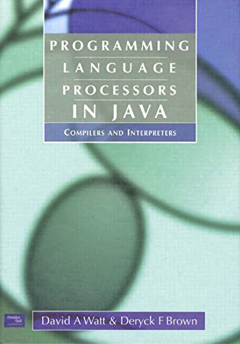

# Programming Language Processors in Java

## Contents

1. [Introduction](Chapter1/Chapter1-Introduction.md)
2. [Language Processors](Chapter2/Chapter2-Language-Processors.md)
3. [Compilation](#)
4. [Syntactic Analysis](#)
5. [Contextual Analysis](#)
6. [Run-Time Organization](#)
7. [Code Generation](#)
8. [Interpretation](#)
9. [Conclusion](#)

